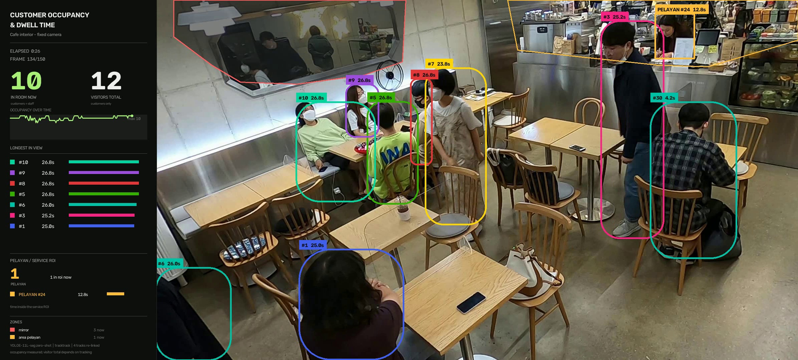
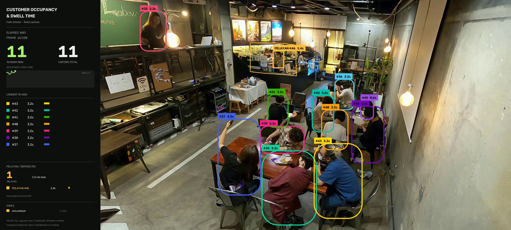
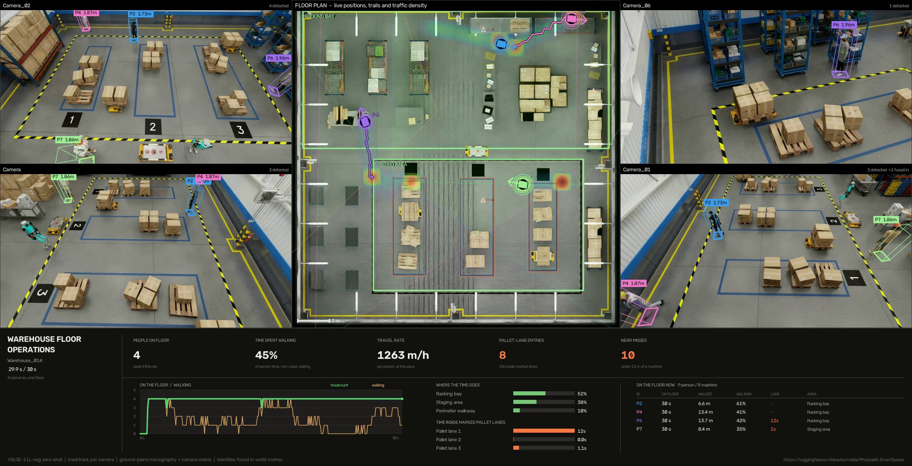

<h1 align="center">factory-vision-poc</h1>

<p align="center">
  <b>Turning a fixed camera into a number an operator can act on</b><br>
  Conveyor counting from text prompts, fill-volume inspection, cafe occupancy
  and dwell time, and multi-camera 3D localisation on a warehouse floor.
</p>

<p align="center">
  
  
  
  
  
</p>

---

## What this is

Six cases on fixed-camera footage. Every figure below was measured by running
the code in this repository, not estimated.

|  | Case | Task | Headline result |
|:--:|---|---|---|
| **1** | Citrus sorting line | Count oranges past a line | **5** counted · 32 tracks |
| **2** | Tomato grading line | Count tomatoes past a line | **16** counted · 50 tracks |
| **3** | Parcel unloading belt | Count mixed packages past a line | **7** counted · 24 tracks |
| **4** | Bottling line | Measure dispensed volume | **1,001 mL** · 66.7 % of nominal |
| **5** | Cafe, two rooms | Occupancy and per-person dwell time | **12** visitors each · mean dwell **21.2 s** / **24.6 s** |
| **6** | Warehouse, four cameras | Locate people in 3D, one floor plan, operational KPIs | median error **0.311 m** vs the dataset's own 3D truth |

Cases 1–3, 5 and 6 are **zero-shot**: the detector is given words, never labels,
never training. Case 4 is a **calibrated inspection**: colour segmentation and
geometry, tuned to one station.

---

## Case 4 — Fill-volume inspection


Product inside the bottle is segmented, the liquid surface is located, and the
volume beneath it is integrated over the bottle's bore as a stack of discs.

| Metric | Value |
|---|---|
| **Dispensed volume** | **1,001 mL** |
| **Fill, by volume** | **66.7 %** |
| Fill, by height | 74.4 % |
| Nominal capacity | 1,500 mL — configured per SKU |
| Reference datum | bottle base → thread line |
| Source clip | 232 frames @ 25 fps, 1920×1080 |
| Trajectory | monotonic, worst frame-to-frame step **3.1 %**, no backward dip |

```bash
python cases/case4_bottle_fill_volume.py                     # end to end
python cases/case4_bottle_fill_volume.py --capacity-ml 1000  # a different SKU
```

<details>
<summary><b>How the volume is derived</b></summary>

<br>

1. **Segment on saturation, not hue.** Calibrated from pixel statistics: product
   in direct view sits at `S 251–255`, while the same product seen *through* the
   bottle's glass sits at `S 104–199`. Their hues are nearly identical, so hue
   alone cannot separate them — saturation can.
2. **Find the surface by width.** The falling stream is a thin column ~3 % of the
   bore; standing liquid spans it. The surface is the highest row covering ≥ 45 %
   of the bore, found by climbing from the base. Taking the topmost lit pixel
   instead tracked the nozzle and over-read the fill.
3. **Integrate the bore, not the mask.** Below the surface the bottle is full, so
   the true cross-section is the bore. Glare and the machine's rods cannot shrink
   the reading — only the surface position matters.
4. **Fit the trajectory.** A 7-frame median removes splash spikes, then an
   isotonic fit enforces that a filling level only rises, then a smoothing pass
   makes the rate physically plausible.
5. **Reference to the thread line.** Capacity runs base → threads, which is what a
   stated fill volume means — not "the fullest this clip happened to get".

Full write-up, including every bug found and how: **[`docs/liquid-level.md`](docs/liquid-level.md)**

</details>

---

## Cases 1–3 — Zero-shot conveyor counting


No training, no labelled data, no fixed class list. Objects are named in plain
English, embedded with `get_text_pe()`, tracked with TrackTrack, and counted as
they cross a line drawn with supervision.

| Case | Scene | Prompts | Counted | Frames |
|:--:|---|---|:--:|:--:|
| 1 | Citrus sorting line | `orange`, `round orange fruit` | 5 | 286 |
| 2 | Tomato grading line | `tomato` | 16 | 212 |
| 3 | Parcel unloading belt | `cardboard box`, `parcel`, `plastic bag`, `sports bag` | 7 | 511 |

```bash
python cases/case1_oranges_counting.py     # citrus line
python cases/case2_tomatoes_counting.py    # tomato line
python cases/case3_packages_counting.py    # parcel belt
```

<details>
<summary><b>The prompt list defines what exists</b> — the most useful finding here</summary>

<br>

An object type nobody names is not missed. **It is invisible**, and nothing in the
output flags it.

The parcel belt ran for several passes with `cardboard box`, `parcel` and
`plastic bag` while a black holdall sat on the belt undetected. Against those
three prompts its best overlap with any predicted box was **IoU 0.01**. It is
fabric, so `plastic bag` never matched it. Not a threshold problem either — it
stayed invisible at `conf=0.04`.

What fixed it is not what you would guess. Measured against the bag's true box:

| Prompt | IoU | conf |
|---|:--:|:--:|
| `sports bag` | **0.81** | 0.56 |
| `duffel bag` | 0.81 | 0.41 |
| `holdall` | 0.81 | 0.46 |
| `black object` | 0.00 | — |
| `luggage` | 0.00 | — |

`black object` is an accurate description and finds nothing; `holdall` is an
obscure word and works. What matters is how close the phrase sits to a concrete
object category, not how correctly it describes the thing.

**Practical rule:** build the prompt list from an inventory of what can travel the
belt, not from whatever happens to be visible in the frames you calibrate on.

More, including the counting rules and threshold-tuning results:
**[`docs/conveyor-counting.md`](docs/conveyor-counting.md)**

</details>

---

## Case 5 — Cafe occupancy and dwell time

<p>
  
  
</p>

The prompt is one word — `person` — and the question is different from the
conveyor cases. There is no line and no travel direction. What is reported is
**occupancy** (how many are in the room now), **visitors** (how many distinct
people have appeared) and **dwell time** per person.

| | Scene 5 | Scene 1 |
|---|:--:|:--:|
| Distinct visitors | **12** | **12** |
| Occupancy, mean / max | 9.00 / 10 | 10.32 / 12 |
| Dwell, mean | **21.19 s** | **24.64 s** |
| Server time in the service zone | 16.02 s | 14.21 s |
| Tracks that were lost and re-acquired | 1 of 12 | 3 of 12 |

```bash
python cases/case5_cafe_dwell_time.py --all
```

<details>
<summary><b>Three decisions that changed the answer</b></summary>

<br>

**Occupancy counts staff; the visitor total does not.** A server standing at the
counter is a person in the room, so she belongs in "how many are here now". A
shift is not a visit, so she does not belong in "how many customers came". The
two figures are deliberately different and the summary says which is which.

**A role belongs to a person, not to a frame.** Deciding staff-vs-customer from
per-frame geometry made a server flip identity the moment she leaned over the
counter. Deciding it once per track, from the share of frames spent inside the
service zone, separates **100 %** from **46 %**. A minimum of 15 frames is
required as well — two customers who paused at the till produced 9- and 5-frame
"staff" tracks before that gate existed.

**Duplicate boxes are separable by containment, not by IoU.** Two boxes on one
seated customer span IoU 0.076–0.485, while genuinely adjacent customers span
0.000–0.425 — the ranges overlap almost entirely, so no NMS threshold splits
them. Intersection over the *smaller* box does, cleanly.

Mirrors are excluded by region, not by appearance: nothing in a reflection's
pixels says "reflection", and what does say it is where it is in a fixed
camera's frame. Each room therefore carries its own zones in
[`factory_vision/dwell/config.py`](factory_vision/dwell/config.py).

</details>

---

## Case 6 — Warehouse: 3D localisation across four cameras



Four fixed cameras, one warehouse floor. Each person is placed **in metres**,
given one identity across all four views, plotted on the building's own top-down
plan with a cumulative traffic heat map, and reduced to the figures a shift
supervisor can act on — labour spent walking, restricted-lane crossings, and
near misses with moving machines.

**What it reports** — the operational block first, the engineering evidence
behind it second:

| Operations | Value |
|---|---|
| Headcount, mean / peak | 3.87 / 4 |
| Time spent walking | **44.7 %** of person-time |
| Travel rate | **1,263 m** per person-hour — ≈ 10.1 km per 8 h shift |
| Time by area | racking 52.1 % · staging 37.7 % · walkway 10.2 % |
| Pallet-lane entries | **8** crossings, 13.3 s inside |
| Near misses under 1.5 m | **18 events**, closest **0.40 m** |

| Measurement quality | Value |
|---|---|
| **Localisation error vs the dataset's 3D truth** | **0.311 m median**, 0.449 m p95 |
| Recall / precision | 0.983 / 0.742 |
| Global IDs per real person | **1.0** — no identity switches in 30 s |
| Measured height per identity | within 0.03–0.08 m of the truth |
| Views per person, mean | 2.71 of 4 |
| Clip | 4 × 30 s, 1920×1080, 10 fps, 1,200 inferences |

```bash
python scripts/fetch_warehouse_scene.py     # once, ~520 MB
python cases/case6_warehouse_spatial.py
```

Full method, the prompt-list measurement and the limits:
**[`docs/warehouse-spatial.md`](docs/warehouse-spatial.md)**

<details>
<summary><b>Counting rules</b></summary>

<br>

- **The line follows the belt, not the frame.** Each clip's travel direction is
  measured from tracked-object displacement, and the counting line is laid
  perpendicular to it — tilted 3–16° off vertical depending on the belt. A line
  parallel to the travel direction would hardly be crossed at all.
- **Direction is IN only.** Endpoint order is derived from the motion vector, so
  forward travel always registers as IN. Reverse crossings are recorded
  separately as a quality signal and excluded from the total.
- **Lock before counting.** An object must be held by the tracker for several
  consecutive frames before it is eligible, so a box that flickers into existence
  on top of the line cannot register a crossing. Locked tracks are drawn `[L]`.

</details>

---

## Quick start

```bash
pip install torch==2.9.1 torchvision==0.24.1 --index-url https://download.pytorch.org/whl/cpu
pip install -e .                    # or: pip install -r requirements.txt
./scripts/fetch_assets.sh           # model weights + clips for cases 1-5
python cases/case4_bottle_fill_volume.py

python scripts/fetch_warehouse_scene.py   # case 6 only, ~520 MB from HuggingFace
python cases/case6_warehouse_spatial.py
```

Run from the repository root. Ultralytics will fetch any missing model weight on
demand, but two of them land relative to the working directory rather than the
repo — the MobileCLIP text encoder (~600 MB) and the tracker's ReID weights — so
`fetch_assets.sh` puts everything where the code expects it.

Each pipeline is also importable on its own:

```python
from factory_vision.counting import run_case
from factory_vision.filling import run_case as measure_fill
from factory_vision.dwell import run_case as measure_dwell
from factory_vision.spatial import run_case as locate_in_3d
```

CPU-only. Reference machine: 4 cores, 1.4–2.5 s/frame at `imgsz=1280` for the
counting cases, depending on what else the machine is doing. Case 4 runs no
network at all and is quicker.

Rendered `.mp4` results are **not committed** — they are build artefacts, and a
source repository should not carry ~60 MB of video. Each case script regenerates
its own into `output/`. The preview stills above and the JSON series
([`summary.json`](output/summary.json),
[`liquid_level_summary.json`](output/liquid_level_summary.json)) are committed, so
every figure quoted here is checkable without them.

---

## Measured vs configured

Worth being precise about, because it is where vision demos usually overclaim:

| Quantity | Status |
|---|---|
| Fill fraction (volume, height) | **measured** |
| Line crossings, track counts | **measured** |
| Occupancy, dwell time, service time | **measured** |
| Floor position, person height (case 6) | **measured**, and checked against the dataset's 3D truth |
| Millilitres | measured fraction × **configured** nominal capacity |
| Bottle geometry, ROI, product colour | **configured** per station |
| Mirror and service zones (case 5) | **configured** per room |
| Person footprint, floor zones (case 6) | **configured** per site |

A video cannot observe how large a bottle is. Give `--capacity-ml` the real SKU
capacity and the millilitre figure means something; leave the default and it is
illustrative. In the same spirit, case 6 measures a person's *height* from the
camera geometry but takes their *footprint* as a constant, because a silhouette
does not carry it.

## Scope

Case 4 is a **calibrated single-station inspection**, not a general model — tied
to one camera position, one bottle and one product colour. That is the normal
arrangement for filling-line vision, which is camera-fixed with a recipe per SKU.

How tied, and how badly it degrades, is measured rather than asserted —
[`factory_vision/tools/perturbation_test.py`](factory_vision/tools/perturbation_test.py) re-renders the clip with
the camera moved and runs the pipeline over it unchanged:

```bash
python -m factory_vision.tools.perturbation_test --sweep
```

The failure is a cliff, not a slope. A 20 % zoom costs **7 %**, and a 60/30 px
shift costs **3.6 %** — but a 120/60 px shift reads **143 mL** against a correct
**1,001 mL**, and 220/110 px reads **23 mL**. Translation is what breaks it, not
scale: the geometry constants are absolute coordinates, so a shift walks the
bottle out of the measuring window while a zoom leaves it roughly where they
expect it.

The size of the error is not the point, though. Every one of those readings is
reported through the same confident panel with no flag saying the calibration no
longer holds. Full table and the eleven installation-specific constants:
[`docs/liquid-level.md`](docs/liquid-level.md).

---

## Layout

```
factory_vision/              the library
  paths.py                   repository paths, resolved once
  detect.py                  detection/tracking pieces shared by several cases
  counting/                  cases 1-3 — zero-shot line counting
    clips.py                 per-clip config: prompts, line, belt motion
    geometry.py              counting line, ROI, size gating
    tracking.py              tracker config resolution
    overlay.py               palette and live HUD
    pipeline.py              detect -> track -> count -> render
    trackers/*.yaml          trackers retuned for zero-shot score ranges
  filling/                   case 4 — fill-volume inspection
    calibration.py           every constant tied to this station
    segmentation.py          product mask and bottle silhouette
    profile.py               bore, surface, isotonic fit, volume
    panel.py                 readout panel and overlay
    pipeline.py              three passes over the clip
  dwell/                     case 5 — occupancy and dwell time
    config.py                per-room zones: mirrors, service points
    pipeline.py              detect -> track -> role -> dwell -> render
  spatial/                   case 6 — multi-camera 3D localisation
    config.py                the scene: cameras, floor zones, clip window
    calibration.py           camera matrix, homography, closed-form height
    bev.py                   the eagle view's world <-> map transform
    lift.py                  2D box -> a place and a height in metres
    fuse.py                  one global identity per person, across cameras
    analytics.py             zones, speed, proximity, ground-truth validation
    render.py                3D wireframes, eagle view, readout panel
    pipeline.py              four views per frame, fused and drawn
  tools/
    probe_prompts.py         prompt/confidence calibration sweep
    tune_thresholds.py       detection-latency measurement
    perturbation_test.py     what a moved camera costs case 4
cases/                       one runnable entry point per case
  case1_oranges_counting.py  … through case6_warehouse_spatial.py
docs/
  liquid-level.md            fill-volume: method, every bug found, limits
  conveyor-counting.md       counting: method, tuning results, failure modes
  warehouse-spatial.md       3D localisation: geometry, fusion, what it costs
scripts/
  fetch_assets.sh            model weights + conveyor/bottle/cafe clips
  fetch_warehouse_scene.py   the warehouse scene and its four 30 s clips
output/                      previews and JSON series (videos gitignored)
```

## Sources

Cases 1–4, footage from [Pexels](https://www.pexels.com), free for commercial
use —
[bottle filling](https://www.pexels.com/video/empty-bottles-in-a-filling-machine-8720278/) ·
[oranges](https://www.pexels.com/video/fruit-on-production-line-10576687/) ·
[tomatoes](https://www.pexels.com/video/tomatoes-on-a-moving-conveyor-belt-8675102/) ·
[parcels](https://www.pexels.com/video/unloading-packages-on-a-conveyor-belt-5370836/)

Case 5, the [CAFE dataset](https://dk-kim.github.io/CAFE/) — two 30-second
excerpts, scenes 1 and 5.

Case 6, [NVIDIA PhysicalAI-SmartSpaces](https://huggingface.co/datasets/nvidia/PhysicalAI-SmartSpaces),
CC BY 4.0 — `MTMC_Tracking_2025/train/Warehouse_014`, four of its twelve
cameras, 30 seconds each. Synthetic (rendered in Omniverse), which is why the
calibration and the 3D ground truth are exact.
