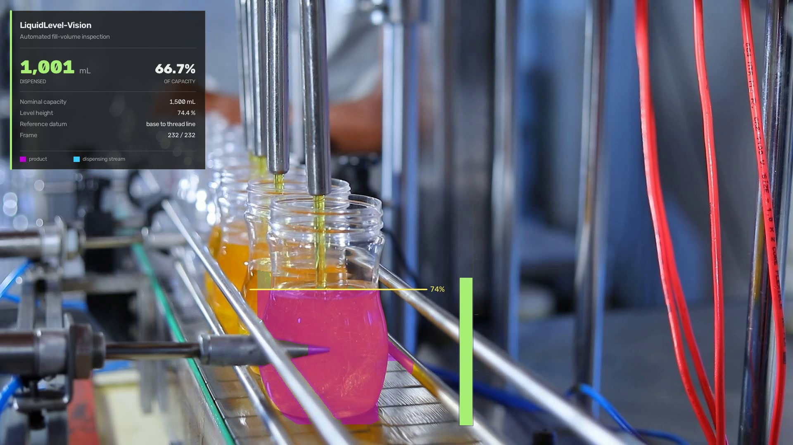
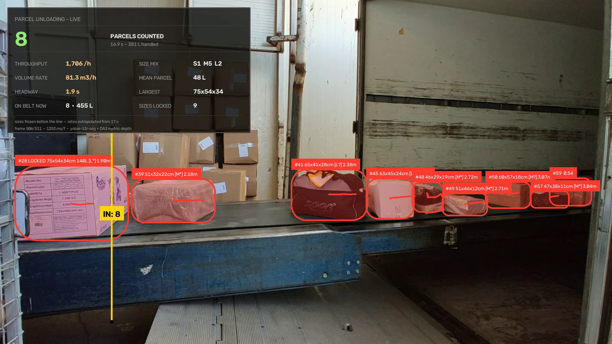
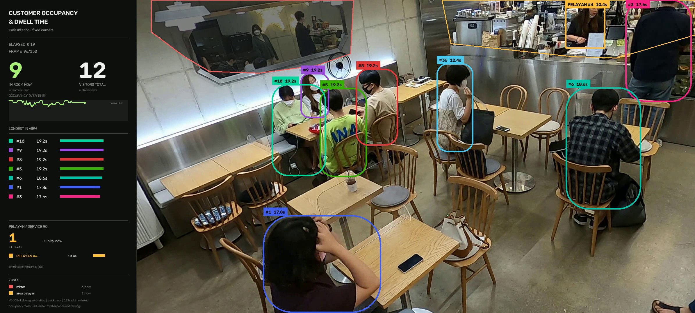
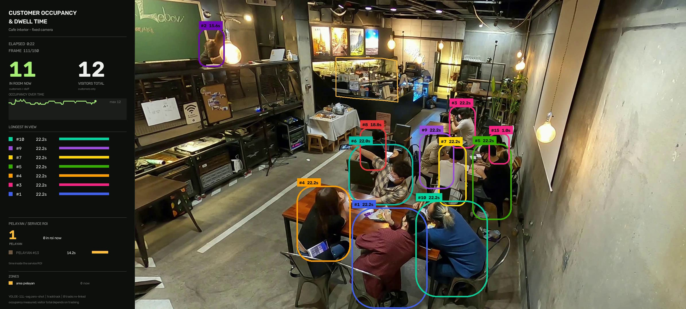
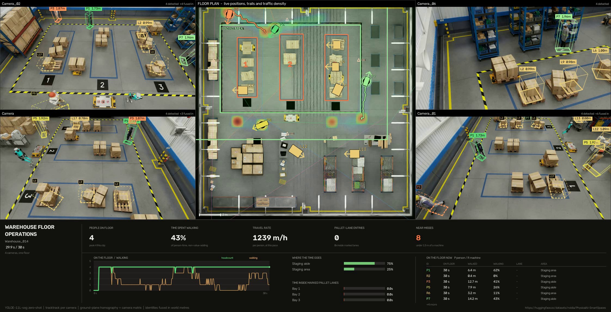

<h1 align="center">factory-vision-poc</h1>

<p align="center">
  <b>Turning a fixed camera into a number an operator can act on</b><br>
  Conveyor counting from text prompts, fill-volume inspection, cafe occupancy
  and dwell time, and multi-camera 3D localisation on a warehouse floor.
</p>

<p align="center">
  
  
  
  
  
</p>

---

## What this is

Six projects on fixed-camera footage, each in its own folder under
[`projects/`](projects), each run with `python main.py`. Every figure below was
measured by running the code in this repository, not estimated.

|  | Case | Task | Headline result |
|:--:|---|---|---|
| **1** | Citrus sorting line | Count oranges past a line | **5** counted · 32 tracks |
| **2** | Tomato grading line | Count tomatoes past a line | **16** counted · 50 tracks |
| **3** | Parcel unloading belt | Count and dimension mixed packages | **8** counted · dimensioned to ±10 % |
| **4** | Bottling line | Measure dispensed volume | **1,001 mL** · 66.7 % of nominal |
| **5** | Cafe, two rooms | Occupancy and per-person dwell time | **12** visitors each · mean dwell **21.2 s** / **24.6 s** |
| **6** | Warehouse, four cameras | Locate people in 3D, one floor plan, operational KPIs | median error **0.181 m** vs the dataset's own 3D truth |

Cases 1–3, 5 and 6 are **zero-shot**: the detector is given words, never labels,
never training. Case 4 is a **calibrated inspection**: colour segmentation and
geometry, tuned to one station.

---

## Case 4 — Fill-volume inspection



Product inside the bottle is segmented, the liquid surface is located, and the
volume beneath it is integrated over the bottle's bore as a stack of discs.

| Metric | Value |
|---|---|
| **Dispensed volume** | **1,001 mL** |
| **Fill, by volume** | **66.7 %** |
| Fill, by height | 74.4 % |
| Nominal capacity | 1,500 mL — configured per SKU |
| Reference datum | bottle base → thread line |
| Source clip | 232 frames @ 25 fps, 1920×1080 |
| Trajectory | monotonic, worst frame-to-frame step **3.1 %**, no backward dip |

```bash
cd projects/04_bottle_fill_volume
python main.py                     # end to end
python main.py --capacity-ml 1000  # a different SKU
```

<details>
<summary><b>How the volume is derived</b></summary>

<br>

1. **Segment on saturation, not hue.** Calibrated from pixel statistics: product
   in direct view sits at `S 251–255`, while the same product seen *through* the
   bottle's glass sits at `S 104–199`. Their hues are nearly identical, so hue
   alone cannot separate them — saturation can.
2. **Find the surface by width.** The falling stream is a thin column ~3 % of the
   bore; standing liquid spans it. The surface is the highest row covering ≥ 45 %
   of the bore, found by climbing from the base. Taking the topmost lit pixel
   instead tracked the nozzle and over-read the fill.
3. **Integrate the bore, not the mask.** Below the surface the bottle is full, so
   the true cross-section is the bore. Glare and the machine's rods cannot shrink
   the reading — only the surface position matters.
4. **Fit the trajectory.** A 7-frame median removes splash spikes, then an
   isotonic fit enforces that a filling level only rises, then a smoothing pass
   makes the rate physically plausible.
5. **Reference to the thread line.** Capacity runs base → threads, which is what a
   stated fill volume means — not "the fullest this clip happened to get".

Full write-up, including every bug found and how: **[`docs/liquid-level.md`](docs/liquid-level.md)**

</details>

---

## Cases 1–3 — Zero-shot conveyor counting


No training, no labelled data, no fixed class list. Objects are named in plain
English, embedded with `get_text_pe()`, tracked with TrackTrack, and counted as
they cross a line drawn with supervision.

| Case | Scene | Prompts | Counted | Frames |
|:--:|---|---|:--:|:--:|
| 1 | Citrus sorting line | `orange`, `round orange fruit` | 5 | 286 |
| 2 | Tomato grading line | `tomato` | 16 | 212 |
| 3 | Parcel unloading belt | `cardboard box`, `parcel`, `plastic bag`, `sports bag`, `styrofoam box` | 8 of 8 | 511 |

```bash
cd projects/01_citrus_counting     && python main.py
cd projects/02_tomato_grading      && python main.py
cd projects/03_parcel_dimensioning && python main.py
```

Three folders, one shared engine, and the only file that differs between the
first two is `config.py`. Each has its own README with its own numbers.

<details>
<summary><b>The prompt list defines what exists</b> — the most useful finding here</summary>

<br>

An object type nobody names is not missed. **It is invisible**, and nothing in the
output flags it.

The parcel belt ran for several passes with `cardboard box`, `parcel` and
`plastic bag` while a black holdall sat on the belt undetected. Against those
three prompts its best overlap with any predicted box was **IoU 0.01**. It is
fabric, so `plastic bag` never matched it. Not a threshold problem either — it
stayed invisible at `conf=0.04`.

What fixed it is not what you would guess. Measured against the bag's true box:

| Prompt | IoU | conf |
|---|:--:|:--:|
| `sports bag` | **0.81** | 0.56 |
| `duffel bag` | 0.81 | 0.41 |
| `holdall` | 0.81 | 0.46 |
| `black object` | 0.00 | — |
| `luggage` | 0.00 | — |

`black object` is an accurate description and finds nothing; `holdall` is an
obscure word and works. What matters is how close the phrase sits to a concrete
object category, not how correctly it describes the thing.

**Practical rule:** build the prompt list from an inventory of what can travel the
belt, not from whatever happens to be visible in the frames you calibrate on.

More, including the counting rules and threshold-tuning results:
**[`docs/conveyor-counting.md`](docs/conveyor-counting.md)**

</details>

<details>
<summary><b>Case 3 also measures each parcel</b> — distance, dimensions and volume from one camera</summary>

<br>



Every parcel on the belt carries its distance and its size; the static stack of
cartons behind it carries nothing, because it is a metre and a half outside the
depth corridor.

Counting a parcel is the easy half. The half a depot bills on is *how big it
was*, and a fixed camera cannot answer that from pixels — the same carton covers
four times the area at half the distance. [Depth Anything
3](https://depth-anything-3.github.io) (ByteDance, Nov 2025) closes the gap.

DA3 splits the problem across two checkpoints, and the pipeline uses both:
`DA3METRIC-LARGE` returns *canonical* depth (metres ÷ focal length) and
`DA3-LARGE` supplies the focal its camera decoder predicts. Multiplying them is
DA3's own recipe — `metres = canonical × f / 300`. The useful consequence is
that **distance inherits the focal's error but size does not**: a length is
`pixels × Z / f` and `Z` already carries an `f`, so it cancels to
`pixels × canonical / 300`.

Sizes are measured against the **belt plane**, not the image axes — otherwise a
carton at an angle reads wider than any of its sides. The plane is fitted once
from a bare-belt depth map (a parcel always sits *on* the belt, so it is always
nearer than the belt it hides; a high percentile across frames removes the
traffic). Residual: **8.4 mm** over ~35,000 px.

**One constant of calibration, validated on an object that did not set it.**
Monocular metric depth is scale-accurate to ~20%, and geometry cannot fix an
error that lives in the depth. Two cartons in this clip print
`Ebat/Dimensions 720x500x340 mm` on the side:

| | Frames | Measured height | After ×1.226 | True |
|---|:--:|:--:|:--:|:--:|
| White carton — sets the scale | 19 | 277.4 mm | — | 340 mm |
| Brown carton — **never used to fit it** | 11 | 277.8 mm | **340.5 mm** | 340 mm |

That says the scale *transfers between objects*. It does not say the depth is
unbiased — both cartons are the same model at similar range. The honest
per-frame error bar is the spread within one pass: **±11%**, which is why every
size is a median over the parcel's whole crossing.

**Depth also fixed something that had nothing to do with size.** The static
stack of cartons at the back of the shot is the same colour, shape and pixel
size as the traffic riding past it. No image threshold separates them, so the
old config fenced them off with a hand-drawn `x > 0.34` band — which clipped
real traffic at the same x and forced the confidence floor up to 0.15.

Two geometric tests replace it, and **both** are needed because each alone lets
something through: a **depth corridor** (1.45–3.20 m) and a test that the
parcel's **base sits on the fitted belt plane** (−0.10…+0.15 m, against +0.12 to
+0.84 m for the stack). The corridor's far bound is the subtle part — a parcel's
body reads up to 0.3 m further back than the belt beneath it, so a 2.95 m bound
rejected three real parcels measured at 2.99, 3.00 and 3.11 m.

That is the architectural point of the case. With the background rejected on
geometry *before the tracker sees it*, the tracker's thresholds no longer have
to double as a background filter: `conf` 0.15 → **0.05**, `new_track_thresh`
0.20 → **0.07**. And the spawn gate turned out to be the binding constraint all
along — one container detected at **0.65 confidence**, sitting squarely on the
belt, carried no box at all, because 0.20 is the threshold for *starting* a
track. Lowering a confidence floor without lowering the spawn gate buys nothing.

**Where the line goes.** At the exit end of the lane, where the belt is nearest
the camera — 2.20 m against 2.90 m at the entry, so one image pixel is 1.6 mm on
the belt instead of 2.1 mm. Every parcel's size is then **frozen 170 px before
the line**, so what gets counted and what got measured are the same number
rather than whatever the last, half-clipped frame said.

**A correction worth recording.** A slit-scan of the counting column shows how
many parcels *reach* it, and this was first read as how many *cross* it. It
records a leading edge arriving; the counting rule fires on the box centre. At
the old mid-lane position that difference was one parcel, whose centre stalled
44 px short as the belt decelerated from −5.03 to **−1.37 px/frame** at the end
of the unload.

</details>

---

## Case 5 — Cafe occupancy and dwell time

<p>
  
  
</p>

The prompt is one word — `person` — and the question is different from the
conveyor cases. There is no line and no travel direction. What is reported is
**occupancy** (how many are in the room now), **visitors** (how many distinct
people have appeared) and **dwell time** per person.

| | Scene 5 | Scene 1 |
|---|:--:|:--:|
| Distinct visitors | **12** | **12** |
| Occupancy, mean / max | 9.00 / 10 | 10.32 / 12 |
| Dwell, mean | **21.19 s** | **24.64 s** |
| Server time in the service zone | 16.02 s | 14.21 s |
| Tracks that were lost and re-acquired | 1 of 12 | 3 of 12 |

```bash
cd projects/05_cafe_dwell_time && python main.py --all
```

<details>
<summary><b>Three decisions that changed the answer</b></summary>

<br>

**Occupancy counts staff; the visitor total does not.** A server standing at the
counter is a person in the room, so she belongs in "how many are here now". A
shift is not a visit, so she does not belong in "how many customers came". The
two figures are deliberately different and the summary says which is which.

**A role belongs to a person, not to a frame.** Deciding staff-vs-customer from
per-frame geometry made a server flip identity the moment she leaned over the
counter. Deciding it once per track, from the share of frames spent inside the
service zone, separates **100 %** from **46 %**. A minimum of 15 frames is
required as well — two customers who paused at the till produced 9- and 5-frame
"staff" tracks before that gate existed.

**Duplicate boxes are separable by containment, not by IoU.** Two boxes on one
seated customer span IoU 0.076–0.485, while genuinely adjacent customers span
0.000–0.425 — the ranges overlap almost entirely, so no NMS threshold splits
them. Intersection over the *smaller* box does, cleanly.

Mirrors are excluded by region, not by appearance: nothing in a reflection's
pixels says "reflection", and what does say it is where it is in a fixed
camera's frame. Each room therefore carries its own zones in
[`projects/05_cafe_dwell_time/config.py`](projects/05_cafe_dwell_time/config.py),
resolved by [`zones.py`](projects/05_cafe_dwell_time/zones.py).

</details>

---

## Case 6 — Warehouse: 3D localisation across four cameras



Four fixed cameras, one warehouse floor. Each person is placed **in metres**,
given one identity across all four views, plotted on the building's own top-down
plan with a cumulative traffic heat map, and reduced to the figures a shift
supervisor can act on — labour spent walking, restricted-lane crossings, and
near misses with moving machines.

**What it reports** — the operational block first, the engineering evidence
behind it second:

| Operations | Value |
|---|---|
| Headcount, mean / peak | 3.87 / 4 |
| Time spent walking | **44.7 %** of person-time |
| Travel rate | **1,263 m** per person-hour — ≈ 10.1 km per 8 h shift |
| Time by area | racking 52.1 % · staging 37.7 % · walkway 10.2 % |
| Pallet-lane entries | **8** crossings, 13.3 s inside |
| Near misses under 1.5 m | **18 events**, closest **0.40 m** |

| Measurement quality | Value |
|---|---|
| **Localisation error vs the dataset's 3D truth** | **0.311 m median**, 0.449 m p95 |
| Recall / precision | 0.983 / 0.742 |
| Global IDs per real person | **1.0** — no identity switches in 30 s |
| Measured height per identity | within 0.03–0.08 m of the truth |
| Views per person, mean | 2.71 of 4 |
| Clip | 4 × 30 s, 1920×1080, 10 fps, 1,200 inferences |

```bash
python scripts/fetch_warehouse_scene.py     # once, ~520 MB
cd projects/06_warehouse_3d && python main.py
```

Full method, the prompt-list measurement and the limits:
**[`docs/warehouse-spatial.md`](docs/warehouse-spatial.md)**

<details>
<summary><b>Counting rules</b></summary>

<br>

- **The line follows the belt, not the frame.** Each clip's travel direction is
  measured from tracked-object displacement, and the counting line is laid
  perpendicular to it — tilted 3–16° off vertical depending on the belt. A line
  parallel to the travel direction would hardly be crossed at all.
- **Direction is IN only.** Endpoint order is derived from the motion vector, so
  forward travel always registers as IN. Reverse crossings are recorded
  separately as a quality signal and excluded from the total.
- **Lock before counting.** An object must be held by the tracker for several
  consecutive frames before it is eligible, so a box that flickers into existence
  on top of the line cannot register a crossing. Locked tracks are drawn `[L]`.

</details>

---

## Quick start

```bash
pip install torch==2.9.1 torchvision==0.24.1 --index-url https://download.pytorch.org/whl/cpu
pip install -r requirements.txt

cd projects/01_citrus_counting && python main.py
```

That is the whole setup. Every project fetches what it is missing on first run —
source clip, model weights, Hugging Face checkpoints — each with a progress bar,
into `input/` and the shared `weights/`. Nothing to download by hand and no
order to remember.

```bash
cd projects/02_tomato_grading    && python main.py
cd projects/03_parcel_dimensioning && python main.py     # + Depth Anything 3, see its README
cd projects/04_bottle_fill_volume  && python main.py     # no network at all
cd projects/05_cafe_dwell_time     && python main.py --all
cd projects/06_warehouse_3d        && python fetch_scene.py && python main.py
```

Only project 03 needs an extra install (Depth Anything 3, which must go in
`--no-deps`; its README gives the four lines). Project 06 fetches a research
dataset with `fetch_scene.py` before its first run.

CPU-only throughout. Reference machine: 4 cores, ~1.2 s/frame at `imgsz=1280`.

Rendered `.mp4` results are **not committed** — they are build artefacts, and a
source repository should not carry ~60 MB of video. Each `main.py` regenerates
its own. Preview stills and `summary.json` are committed, so the numbers in
every README can be checked without running anything.

## Layout

Six projects, six folders. Each one is self-contained: its own `main.py`, its
own `input/` and `output/`, its own README with its own measured results.

```
projects/
  01_citrus_counting/       count oranges from words alone
  02_tomato_grading/        the same engine, one word changed
  03_parcel_dimensioning/   count + distance + size, via Depth Anything 3
  04_bottle_fill_volume/    dispensed millilitres, colour and geometry
  05_cafe_dwell_time/       occupancy and per-person dwell
  06_warehouse_3d/          four cameras -> one floor plan in metres

    every project has these four
      main.py               the entry point, and only the sequence of steps
      config.py             every constant, with the measurement that set it
      assets.py             what must be downloaded before a run
      report.py             the console read-out
      README.md             what it does, what it measured, what breaks it
      input/  output/       this project's own video in, results out

    and the four that carry their own pipeline split it by stage, e.g.
      04: roi -> segmentation -> profile -> bore -> level -> pipeline -> panel
      05: zones -> detection -> identity -> roles -> render -> summary

factory_vision/             the shared half, and only what is genuinely shared
  assets.py                 first-run downloads with a progress bar
  paths.py                  per-project input/output, shared weights
  detect.py                 detection filtering used by three projects
  tracking.py               tracker gates retuned for zero-shot score ranges
  trackers/*.yaml
  counting/                 the counting engine behind projects 01-03
    pipeline.py             detect -> track -> count -> render
    clips.py                the ClipConfig each project fills in
    geometry.py             the counting line, ROI, detection gating
    measuring.py            the protocol a project implements if it also
                            measures; only project 03 does, and its depth
                            and sizing code lives in that project
    overlay.py              palette and the live operations panel
  tools/                    calibration and measurement scripts

weights/                    shared model cache (gitignored)
docs/                       long-form method write-ups
```

Projects 01, 02 and 03 share `factory_vision/counting/` rather than each holding
a copy. They differ **only** in `config.py`, which is the entire zero-shot claim
— and three copies of one tracker would drift apart on the next fix.

## Sources

Cases 1–4, footage from [Pexels](https://www.pexels.com), free for commercial
use —
[bottle filling](https://www.pexels.com/video/empty-bottles-in-a-filling-machine-8720278/) ·
[oranges](https://www.pexels.com/video/fruit-on-production-line-10576687/) ·
[tomatoes](https://www.pexels.com/video/tomatoes-on-a-moving-conveyor-belt-8675102/) ·
[parcels](https://www.pexels.com/video/unloading-packages-on-a-conveyor-belt-5370836/)

Case 5, the [CAFE dataset](https://dk-kim.github.io/CAFE/) — two 30-second
excerpts, scenes 1 and 5.

Case 6, [NVIDIA PhysicalAI-SmartSpaces](https://huggingface.co/datasets/nvidia/PhysicalAI-SmartSpaces),
CC BY 4.0 — `MTMC_Tracking_2025/train/Warehouse_014`, four of its twelve
cameras, 30 seconds each. Synthetic (rendered in Omniverse), which is why the
calibration and the 3D ground truth are exact.
