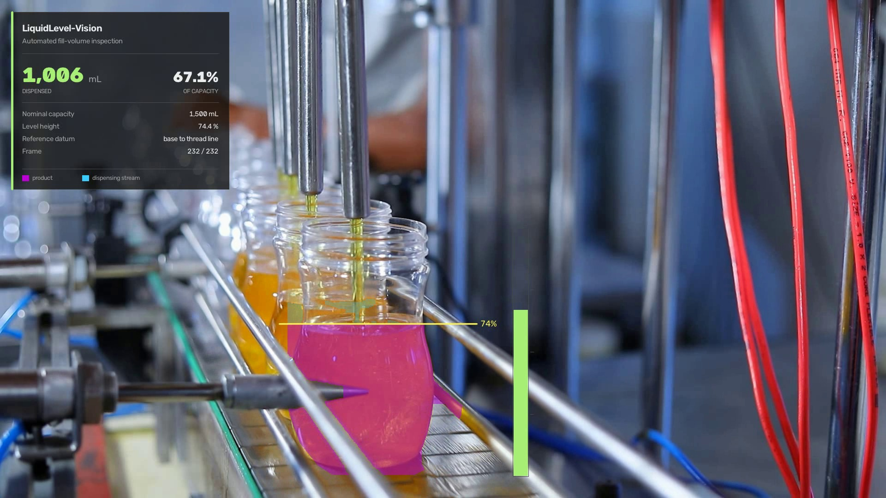
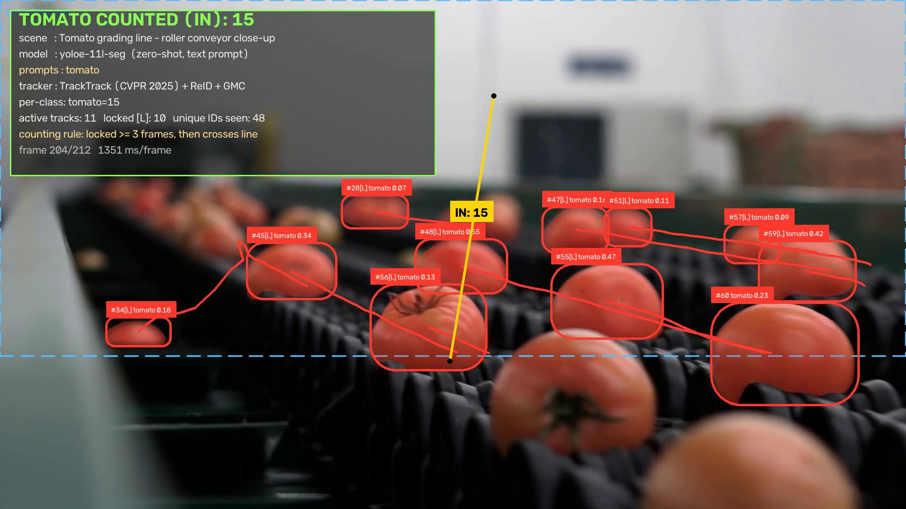

<h1 align="center">factory-vision-poc</h1>

<p align="center">
  <b>Computer vision for production lines</b><br>
  Fill-volume inspection on a bottling line, and object counting on conveyors
  driven entirely by text prompts.
</p>

<p align="center">
  
  
  
  
  
</p>

---

## What this is

Four cases on real factory footage. Every figure below was measured by running
the code in this repository, not estimated.

|  | Case | Task | Headline result |
|:--:|---|---|---|
| **1** | Citrus sorting line | Count oranges past a line | **5** counted · 32 tracks |
| **2** | Tomato grading line | Count tomatoes past a line | **16** counted · 50 tracks |
| **3** | Parcel unloading belt | Count mixed packages past a line | **7** counted · 24 tracks |
| **4** | Bottling line | Measure dispensed volume | **1,001 mL** · 66.7 % of nominal |

Cases 1–3 are **zero-shot**: the detector is given words, never labels, never
training. Case 4 is a **calibrated inspection**: colour segmentation and
geometry, tuned to one station.

---

## Case 4 — Fill-volume inspection



Product inside the bottle is segmented, the liquid surface is located, and the
volume beneath it is integrated over the bottle's bore as a stack of discs.

| Metric | Value |
|---|---|
| **Dispensed volume** | **1,001 mL** |
| **Fill, by volume** | **66.7 %** |
| Fill, by height | 74.4 % |
| Nominal capacity | 1,500 mL — configured per SKU |
| Reference datum | bottle base → thread line |
| Source clip | 232 frames @ 25 fps, 1920×1080 |
| Trajectory | monotonic, worst frame-to-frame step **3.1 %**, no backward dip |

```bash
python cases/case4_bottle_fill_volume.py                     # end to end
python cases/case4_bottle_fill_volume.py --capacity-ml 1000  # a different SKU
```

<details>
<summary><b>How the volume is derived</b></summary>

<br>

1. **Segment on saturation, not hue.** Calibrated from pixel statistics: product
   in direct view sits at `S 251–255`, while the same product seen *through* the
   bottle's glass sits at `S 104–199`. Their hues are nearly identical, so hue
   alone cannot separate them — saturation can.
2. **Find the surface by width.** The falling stream is a thin column ~3 % of the
   bore; standing liquid spans it. The surface is the highest row covering ≥ 45 %
   of the bore, found by climbing from the base. Taking the topmost lit pixel
   instead tracked the nozzle and over-read the fill.
3. **Integrate the bore, not the mask.** Below the surface the bottle is full, so
   the true cross-section is the bore. Glare and the machine's rods cannot shrink
   the reading — only the surface position matters.
4. **Fit the trajectory.** A 7-frame median removes splash spikes, then an
   isotonic fit enforces that a filling level only rises, then a smoothing pass
   makes the rate physically plausible.
5. **Reference to the thread line.** Capacity runs base → threads, which is what a
   stated fill volume means — not "the fullest this clip happened to get".

Full write-up, including every bug found and how: **[`docs/liquid-level.md`](docs/liquid-level.md)**

</details>

---

## Cases 1–3 — Zero-shot conveyor counting



No training, no labelled data, no fixed class list. Objects are named in plain
English, embedded with `get_text_pe()`, tracked with TrackTrack, and counted as
they cross a line drawn with supervision.

| Case | Scene | Prompts | Counted | Frames |
|:--:|---|---|:--:|:--:|
| 1 | Citrus sorting line | `orange`, `round orange fruit` | 5 | 286 |
| 2 | Tomato grading line | `tomato` | 16 | 212 |
| 3 | Parcel unloading belt | `cardboard box`, `parcel`, `plastic bag`, `sports bag` | 7 | 511 |

```bash
python cases/case1_oranges_counting.py     # citrus line
python cases/case2_tomatoes_counting.py    # tomato line
python cases/case3_packages_counting.py    # parcel belt
```

<details>
<summary><b>The prompt list defines what exists</b> — the most useful finding here</summary>

<br>

An object type nobody names is not missed. **It is invisible**, and nothing in the
output flags it.

The parcel belt ran for several passes with `cardboard box`, `parcel` and
`plastic bag` while a black holdall sat on the belt undetected. Against those
three prompts its best overlap with any predicted box was **IoU 0.01**. It is
fabric, so `plastic bag` never matched it. Not a threshold problem either — it
stayed invisible at `conf=0.04`.

What fixed it is not what you would guess. Measured against the bag's true box:

| Prompt | IoU | conf |
|---|:--:|:--:|
| `sports bag` | **0.81** | 0.56 |
| `duffel bag` | 0.81 | 0.41 |
| `holdall` | 0.81 | 0.46 |
| `black object` | 0.00 | — |
| `luggage` | 0.00 | — |

`black object` is an accurate description and finds nothing; `holdall` is an
obscure word and works. What matters is how close the phrase sits to a concrete
object category, not how correctly it describes the thing.

**Practical rule:** build the prompt list from an inventory of what can travel the
belt, not from whatever happens to be visible in the frames you calibrate on.

More, including the counting rules and threshold-tuning results:
**[`docs/conveyor-counting.md`](docs/conveyor-counting.md)**

</details>

<details>
<summary><b>Counting rules</b></summary>

<br>

- **The line follows the belt, not the frame.** Each clip's travel direction is
  measured from tracked-object displacement, and the counting line is laid
  perpendicular to it — tilted 3–16° off vertical depending on the belt. A line
  parallel to the travel direction would hardly be crossed at all.
- **Direction is IN only.** Endpoint order is derived from the motion vector, so
  forward travel always registers as IN. Reverse crossings are recorded
  separately as a quality signal and excluded from the total.
- **Lock before counting.** An object must be held by the tracker for several
  consecutive frames before it is eligible, so a box that flickers into existence
  on top of the line cannot register a crossing. Locked tracks are drawn `[L]`.

</details>

---

## Quick start

```bash
pip install torch==2.9.1 torchvision==0.24.1 --index-url https://download.pytorch.org/whl/cpu
pip install -r requirements.txt
./scripts/fetch_assets.sh          # model weights + source clips
python cases/case4_bottle_fill_volume.py
```

CPU-only. Reference machine: 4 cores, 1.4–2.5 s/frame at `imgsz=1280` for the
counting cases, depending on what else the machine is doing. Case 4 runs no
network at all and is quicker.

Rendered `.mp4` results are **not committed** — they are build artefacts, and a
source repository should not carry ~60 MB of video. Each case script regenerates
its own into `output/`. The preview stills above and the JSON series
([`summary.json`](output/summary.json),
[`liquid_level_summary.json`](output/liquid_level_summary.json)) are committed, so
every figure quoted here is checkable without them.

---

## Measured vs configured

Worth being precise about, because it is where vision demos usually overclaim:

| Quantity | Status |
|---|---|
| Fill fraction (volume, height) | **measured** |
| Line crossings, track counts | **measured** |
| Millilitres | measured fraction × **configured** nominal capacity |
| Bottle geometry, ROI, product colour | **configured** per station |

A video cannot observe how large a bottle is. Give `--capacity-ml` the real SKU
capacity and the millilitre figure means something; leave the default and it is
illustrative.

## Scope

Case 4 is a **calibrated single-station inspection**, not a general model — tied
to one camera position, one bottle and one product colour. That is the normal
arrangement for filling-line vision, which is camera-fixed with a recipe per SKU.

How tied, and how badly it degrades, is measured rather than asserted —
[`src/perturbation_test.py`](src/perturbation_test.py) re-renders the clip with
the camera moved and runs the pipeline over it unchanged:

```bash
python src/perturbation_test.py --sweep
```

The failure is a cliff, not a slope. A 20 % zoom costs **7 %**, and a 60/30 px
shift costs **3.6 %** — but a 120/60 px shift reads **143 mL** against a correct
**1,001 mL**, and 220/110 px reads **23 mL**. Translation is what breaks it, not
scale: the geometry constants are absolute coordinates, so a shift walks the
bottle out of the measuring window while a zoom leaves it roughly where they
expect it.

The size of the error is not the point, though. Every one of those readings is
reported through the same confident panel with no flag saying the calibration no
longer holds. Full table and the eleven installation-specific constants:
[`docs/liquid-level.md`](docs/liquid-level.md).

---

## Layout

```
cases/                       one runnable entry point per case
  case1_oranges_counting.py
  case2_tomatoes_counting.py
  case3_packages_counting.py
  case4_bottle_fill_volume.py
src/
  liquid_level.py            fill-volume inspection
  conveyor_count.py          zero-shot line counting
  probe_prompts.py           prompt/confidence calibration sweep
  tune_thresholds.py         detection-latency measurement
  trackers/*.yaml            trackers retuned for zero-shot score ranges
docs/
  liquid-level.md            fill-volume: method, every bug found, limits
  conveyor-counting.md       counting: method, tuning results, failure modes
scripts/fetch_assets.sh      model weights + source clips
output/                      previews and JSON series (videos gitignored)
```

## Sources

Footage from [Pexels](https://www.pexels.com), free for commercial use —
[bottle filling](https://www.pexels.com/video/empty-bottles-in-a-filling-machine-8720278/) ·
[oranges](https://www.pexels.com/video/fruit-on-production-line-10576687/) ·
[tomatoes](https://www.pexels.com/video/tomatoes-on-a-moving-conveyor-belt-8675102/) ·
[parcels](https://www.pexels.com/video/unloading-packages-on-a-conveyor-belt-5370836/)
