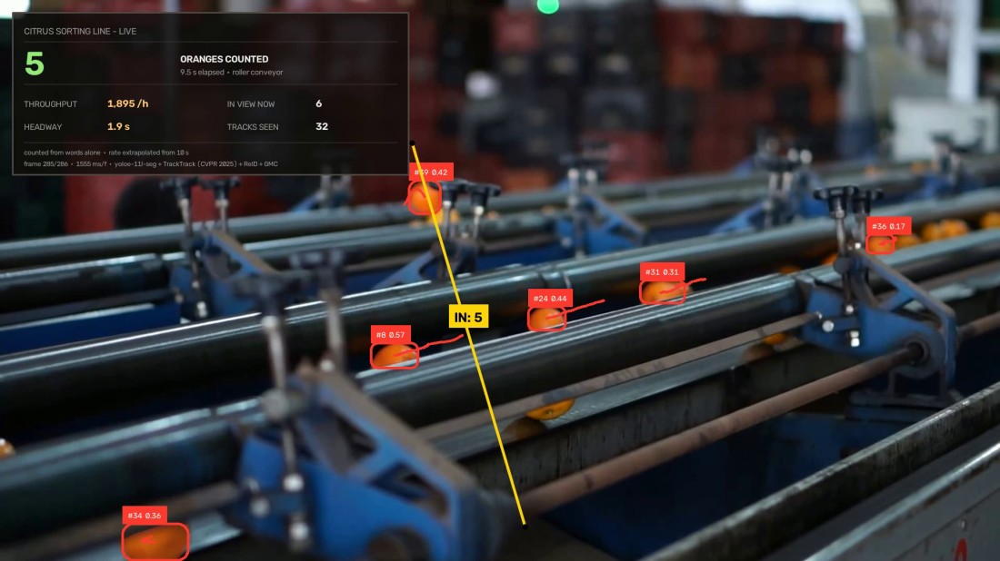

# Citrus Counting — zero-shot conveyor counting

Count oranges crossing a line on a sorting conveyor, using a detector that was
never trained on oranges. Two words go in; a verified count comes out.



*Last frame of the clip. Each box carries `#track confidence`, the red trail is
where that orange has travelled, and the yellow line is the counting line — laid
across the belt rather than down the frame. The dashboard prints only what this
project measures: a count, a rate and a headway. No size, because nothing here
measures size.*

## Result

| | |
|---|---|
| **Counted** | **5** line crossings, 0 reverse |
| Tracks held | 32 unique IDs |
| Detections | 7.7 per frame |
| Clip | 286 frames, 1920×1080 @ 30 fps (9.5 s) |
| Speed | 1.56 s/frame, CPU-only |

Counted by hand from the rendered video: five oranges complete a crossing in
these 286 frames. `baseline.py` holds that figure and every run prints itself
against it, so a change that moves the count says so on the console instead of
passing silently.

**Tracks are not counts.** 32 identities were held and 5 were counted, because
fruit enters and leaves at the frame edges without ever reaching the line. The
two figures are reported separately and only the first is the answer.

## Run it

```bash
python main.py
```

Two kinds of dependency, handled two ways.

**The model weights download themselves** on the first run, with a progress bar,
into `weights/`. One copy of a checkpoint is the same as any other, so there is
nothing to get wrong.

**The source clip you fetch yourself.** Run `main.py` once and it prints the
link, the exact rendition and a ready-made `curl`:

```bash
curl -L -o 'input/01_oranges_production_line.mp4' \
     'https://videos.pexels.com/video-files/10576687/10576687-hd_1920_1080_30fps.mp4'
```

Source page: [Pexels 10576687](https://www.pexels.com/video/fruit-on-production-line-10576687/) ·
rendition `hd_1920_1080_30fps` (1920×1080).

That step is deliberately yours. The clip is the thing being measured, and the
counting line and the box-area limit in `config.py` are pixel coordinates on that
one rendition — so the file is checked when it arrives and **refused if its frame
size is different**, rather than quietly measured with constants meant for
something else.

The annotated video and `summary.json` then land in `output/`.

<details>
<summary>Python environment</summary>

Python 3.11, CPU is enough. Verified working set:

```bash
pip install torch==2.9.1 torchvision==0.24.1 --index-url https://download.pytorch.org/whl/cpu
pip install ultralytics==8.4.106 supervision==0.29.1 opencv-python==5.0.0.93 lap PyYAML==6.0.1
```

`ultralytics` ships both YOLOE and TrackTrack. On the first `get_text_pe()` call
it pulls the MobileCLIP text encoder (~572 MB) and the `clip`/`ftfy`/`regex`
packages by itself.

Downloaded on first run: `yoloe-11l-seg.pt` (detector) and `yolo11n-cls.pt`
(the tracker's re-identification backbone). The clip is not — see above.

</details>

## How it works

1. **Prompt.** `["orange", "round orange fruit"]` is encoded by MobileCLIP into
   text embeddings, and YOLOE-11L-seg is told those are its classes. There is no
   fine-tuning step and no labelled orange anywhere in the project.
2. **Detect** at 1280 px with a confidence floor of 0.095, then discard boxes
   larger than 5 % of the frame — at this working distance an orange cannot be
   that big, so anything that is, is not an orange.
3. **Track** with TrackTrack (CVPR 2025), with re-identification and global
   motion compensation on, so an identity survives the fruit rolling behind a
   roller frame.
4. **Count** a crossing of a line built square across the belt: the line is laid
   perpendicular to the belt's measured travel of (−3.21, +0.94) px/frame, which
   puts it 16.4° off vertical, and the endpoint order is probed so that travel
   registers as IN and reverse motion as a separate figure.
5. **Report** to the console and to `output/summary.json`, then check the count
   against `baseline.py`.

A track must survive 4 frames before it may count. That is the cheapest guard
against a one-frame false positive incrementing a production figure.

## The calibration that actually matters

`config.py` is the whole project, and the interesting line in it is the
confidence floor.

| conf | detections/frame | median entry lag | verdict |
|---|:--:|:--:|---|
| 0.14 | 5.9 | 0.303 | fruit acquired late |
| **0.095** | **7.0** | **0.276** | in use |
| 0.063 | — | barely moved | track count nearly doubled |

Dropping the floor from 0.14 to 0.095 genuinely helped. Dropping it further to
0.063 did not: the extra detections were *fragments of fruit already being
tracked*, not earlier pickups, so the track count rose while the share of
objects acquired early did not. **A lower threshold is not the same thing as
better recall**, and the only way to know which one you have is to measure where
objects are first seen rather than how many boxes appear.

Those figures come from a threshold sweep that measures *where* objects are
first acquired, not how many boxes appear. It lives in the monorepo this project
came from, so the numbers are recorded here rather than regenerable from this
folder alone. The same sweep on the tomato line reached the opposite conclusion —
tuning is per-installation.

## What is in this project

| | |
|---|---|
| `main.py` | entry point — fetch, run, report. No logic of its own |
| `config.py` | the prompts, the confidence floor, the counting line, the belt's measured travel |
| `assets.py` | what has to be downloaded before a run, declared in one place |
| `panel.py` | what the live dashboard shows — rate, headway, what is in view |
| `report.py` | the console read-out, including the regression line |
| `baseline.py` | the last verified count, checked and printed on every run |
| `input/` | the source clip **you** put here |
| `output/` | annotated video and `summary.json` |
| `docs/` | the still used in this README |

Every module carries a docstring explaining not just what it does but which
failure made it necessary. `panel.py` is the clearest example: this project once
rendered all 286 frames captioned **PARCEL UNLOADING**, counting **PARCELS**,
with five structural zeros and a footer crediting a depth model it never loads —
because the dashboard was hardcoded in the shared engine for a different belt.
The rule that file now enforces is that **a project prints only what it
measures**. A citrus line has no size, volume or depth row, so there is none.

## What this does not do

- **It does not count every orange on the machine.** It counts crossings of one
  line. Fruit that leaves the frame before reaching it is tracked and not
  counted, which is correct and is why the two numbers are printed side by side.
- **Throughput is extrapolated.** 1,895 /h comes from 5 crossings in 9.5
  seconds. The panel says `rate extrapolated from 10 s` on the frame, because a
  rate quoted from a ten-second clip is a demonstration, not a claim.
- **It does not measure size.** No depth model is loaded and no size row exists.
- **The calibration is per-installation.** Move the camera and the counting line,
  the belt travel and the box-area limit all need re-measuring. The prompts
  transfer; the geometry does not.

## The engine, vendored

This project is self-contained: every module it imports is in this
folder, so it runs wherever you put it.

```
<project folder>/
├── main.py, config.py, assets.py, panel.py, report.py, baseline.py
├── factory_vision/            the engine, vendored so this folder stands alone
│   ├── assets.py              weight downloads, and the manual-clip check
│   ├── paths.py               where weights, input and output live
│   ├── tracking.py            TrackTrack config resolution
│   ├── trackers/*.yaml        gates retuned for zero-shot score ranges
│   └── counting/
│       ├── clips.py           ClipConfig — the per-clip contract
│       ├── geometry.py        the counting line, the ROI, size gating
│       ├── pipeline.py        detect → track → count → render
│       ├── overlay.py         how to draw a panel (not what goes on one)
│       └── measuring.py       the measurement protocol, unused here
└── input/  output/  docs/
```

`factory_vision/` is the counting engine, and it came from a monorepo where
one copy served this project, the tomatoes line and the parcel belt. Those
three differ only in `config.py` and `panel.py`, which is the whole zero-shot
claim — but a shared package cannot travel into three separate repositories,
so each carries its own copy. The trade is real and worth naming: a fix to the
tracker now has to be applied in each place rather than once.

`measuring.py` is a Protocol the pipeline calls only when a project hands it a
measurement backend. This one does not, so "this line does not measure" is
structural — no depth model, no checkpoints — rather than a flag set to
`False`.

## Credits

- Clip: [Pexels 10576687](https://www.pexels.com/video/fruit-on-production-line-10576687/)
- Detector: [YOLOE](https://docs.ultralytics.com/models/yoloe/) (`yoloe-11l-seg`) with the MobileCLIP-BLT text encoder
- Tracker: [TrackTrack](https://openaccess.thecvf.com/content/CVPR2025/html/Shim_Focusing_on_Tracks_for_Online_Multi-Object_Tracking_CVPR_2025_paper.html) (CVPR 2025), via `ultralytics`
- Counting and annotation: [supervision](https://supervision.roboflow.com/)
