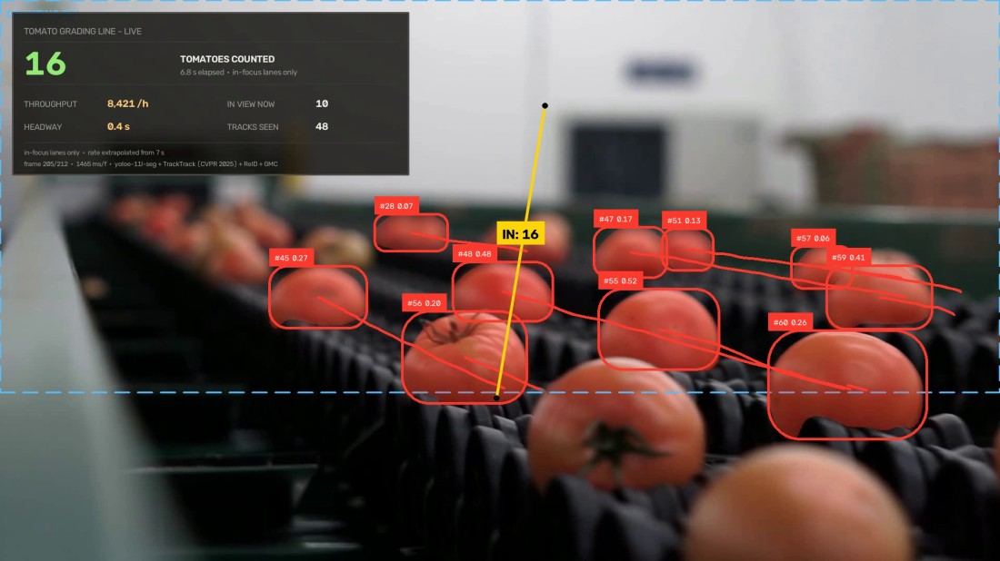

# Tomato Grading — zero-shot conveyor counting

Count tomatoes crossing a line on a grading conveyor, using a detector that was
never trained on tomatoes. One word goes in; a verified count comes out.



*Last frame of the clip. The dashed rectangle is the counting ROI — everything
below it is the blurred near lane, deliberately outside the count, which is why
the dashboard says `in-focus lanes only`. The yellow line is tilted 9.4° to sit
square across a lane that recedes up and to the left.*

## Result

| | |
|---|---|
| **Counted** | **16** line crossings, 0 reverse |
| Tracks held | 50 unique IDs |
| Detections | 11.9 per frame |
| Clip | 212 frames, 1920×1080 @ 29.97 fps (7.1 s) |
| Speed | 1.52 s/frame, CPU-only |
| Scope | in-focus lanes only — see below |

Counted by hand from the rendered video. `baseline.py` holds that figure and
every run prints itself against it, so a change that moves the count says so on
the console instead of passing silently.

**Tracks are not counts.** 50 identities were held and 16 were counted: on a
close-up like this most fruit crosses the frame without ever reaching the line.
The two figures are reported separately and only the first is the answer.

## Run it

```bash
python main.py
```

Two kinds of dependency, handled two ways.

**The model weights download themselves** on the first run, with a progress bar,
into `weights/`.

**The source clip you fetch yourself.** Run `main.py` once and it prints the
link, the exact rendition and a ready-made `curl`:

```bash
curl -L -o 'input/02_tomatoes_conveyor.mp4' \
     'https://videos.pexels.com/video-files/8675102/8675102-hd_1920_1080_30fps.mp4'
```

Source page: [Pexels 8675102](https://www.pexels.com/video/tomatoes-on-a-moving-conveyor-belt-8675102/) ·
rendition `hd_1920_1080_30fps` (1920×1080).

That step is deliberately yours. The tilted counting line and the y-ROI in
`config.py` are pixel coordinates on that one rendition, so the file is checked
when it arrives and **refused if its frame size is different**.

The annotated video and `summary.json` then land in `output/`.

<details>
<summary>Python environment</summary>

Python 3.11, CPU is enough. Verified working set:

```bash
pip install torch==2.9.1 torchvision==0.24.1 --index-url https://download.pytorch.org/whl/cpu
pip install ultralytics==8.4.106 supervision==0.29.1 opencv-python==5.0.0.93 lap PyYAML==6.0.1
```

`ultralytics` ships both YOLOE and TrackTrack. On the first `get_text_pe()` call
it pulls the MobileCLIP text encoder (~572 MB) and the `clip`/`ftfy`/`regex`
packages by itself.

Downloaded on first run: `yoloe-11l-seg.pt` (detector) and `yolo11n-cls.pt`
(the tracker's re-identification backbone). The clip is not — see above.

</details>

## How it works

1. **Prompt.** `["tomato"]` is encoded by MobileCLIP into a text embedding and
   YOLOE-11L-seg is told that is its class list. No fine-tuning, no labelled
   tomato anywhere in the project.
2. **Detect** at 1280 px with a confidence floor of 0.059, discarding boxes over
   6 % of the frame and anything whose centre falls outside the y-ROI.
3. **Track** with TrackTrack (CVPR 2025) with re-identification and global motion
   compensation, gates opened to match the low confidence floor.
4. **Count** crossings of a line laid perpendicular to the belt's measured travel
   of (−14.79, −2.47) px/frame. The lane recedes up and to the left, so square
   across it means **9.4° off vertical** rather than parallel to the frame edge.
5. **Report** to the console and `output/summary.json`, then check against
   `baseline.py`.

A track must survive 3 frames before it may count — the cheapest guard against a
one-frame false positive incrementing a production figure.

## Why this project exists next to the citrus line

To make the zero-shot claim checkable rather than asserted. Same weights, same
tracker, same counting rule, the same six modules in the same shape. Exactly two
files differ from `01_citrus_counting`:

- **`config.py`** — one prompt instead of two, a different confidence floor, a
  line tilted 9.4° instead of 16.4°, and a y-ROI.
- **`panel.py`** — the words on the dashboard.

Nothing else. If a new belt needed new code, the claim would be empty.

## Threshold tuning, on the one clip where it paid

| | before | after |
|---|:--:|:--:|
| conf | 0.13 | **0.059** |
| median entry lag | 0.326 | **0.203** |
| acquired within 15 % of the frame edge | 21 % | **50 %** |

Lowering the floor with the tracker gates opened more than doubled the share of
tomatoes picked up as they entered view. **The same change did almost nothing on
the citrus line**, where the extra detections turned out to be fragments of fruit
already tracked. Tuning is per-installation, and the only way to tell the two
outcomes apart is to measure *where objects are first seen* rather than how many
boxes appear.

Those figures come from a threshold sweep that measures *where* objects are
first acquired. It lives in the monorepo this project came from, so they are
recorded here rather than regenerable from this folder alone.

## The near lane is deliberately excluded

The foreground lane sits outside the depth of field. Those tomatoes smear across
several frames' worth of travel, break identity, and would be counted twice or
not at all. `roi_y=(0.0, 0.70)` restricts counting to the in-focus lanes, the
boundary is drawn on the frame as a dashed rectangle, and the panel is captioned
`in-focus lanes only` so the number cannot be read as every tomato on the
machine.

That is a **config decision, not a code one** — which is the point of keeping the
per-clip contract in one dataclass.

## What is in this project

| | |
|---|---|
| `main.py` | entry point — identical to project 01's but for the case number |
| `config.py` | one prompt, a line 9.4° off vertical, and the y-ROI |
| `assets.py` | what has to be downloaded, declared in one place |
| `panel.py` | the dashboard — same shape as 01's, different words |
| `report.py` | the console read-out; identical to 01's, so the two outputs compare line by line |
| `baseline.py` | the last verified count, checked and printed on every run |
| `input/` | the source clip **you** put here |
| `output/` | annotated video and `summary.json` |
| `docs/` | the still used in this README |

## What this does not do

- **It does not count every tomato on the machine** — only crossings of one line,
  in the in-focus lanes, as the panel states on the frame.
- **Throughput is extrapolated.** 8,421 /h comes from 16 crossings in 6.8
  seconds, and the frame says so.
- **It does not grade.** Nothing here measures size, colour or defects; the name
  is the scene, not the capability.
- **The calibration is per-installation.** The prompt transfers; the line, the
  travel vector, the ROI and the box-area limit are properties of this camera.

## The engine, vendored

This project is self-contained: every module it imports is in this
folder, so it runs wherever you put it.

```
<project folder>/
├── main.py, config.py, assets.py, panel.py, report.py, baseline.py
├── factory_vision/            the engine, vendored so this folder stands alone
│   ├── assets.py              weight downloads, and the manual-clip check
│   ├── paths.py               where weights, input and output live
│   ├── tracking.py            TrackTrack config resolution
│   ├── trackers/*.yaml        gates retuned for zero-shot score ranges
│   └── counting/
│       ├── clips.py           ClipConfig — the per-clip contract
│       ├── geometry.py        the counting line, the ROI, size gating
│       ├── pipeline.py        detect → track → count → render
│       ├── overlay.py         how to draw a panel (not what goes on one)
│       └── measuring.py       the measurement protocol, unused here
└── input/  output/  docs/
```

`factory_vision/` is the counting engine, and it came from a monorepo where
one copy served this project, the oranges line and the parcel belt. Those
three differ only in `config.py` and `panel.py`, which is the whole zero-shot
claim — but a shared package cannot travel into three separate repositories,
so each carries its own copy. The trade is real and worth naming: a fix to the
tracker now has to be applied in each place rather than once.

`measuring.py` is a Protocol the pipeline calls only when a project hands it a
measurement backend. This one does not, so "this line does not measure" is
structural — no depth model, no checkpoints — rather than a flag set to
`False`.

## Credits

- Clip: [Pexels 8675102](https://www.pexels.com/video/tomatoes-on-a-moving-conveyor-belt-8675102/)
- Detector: [YOLOE](https://docs.ultralytics.com/models/yoloe/) (`yoloe-11l-seg`) with the MobileCLIP-BLT text encoder
- Tracker: [TrackTrack](https://openaccess.thecvf.com/content/CVPR2025/html/Shim_Focusing_on_Tracks_for_Online_Multi-Object_Tracking_CVPR_2025_paper.html) (CVPR 2025), via `ultralytics`
- Counting and annotation: [supervision](https://supervision.roboflow.com/)
