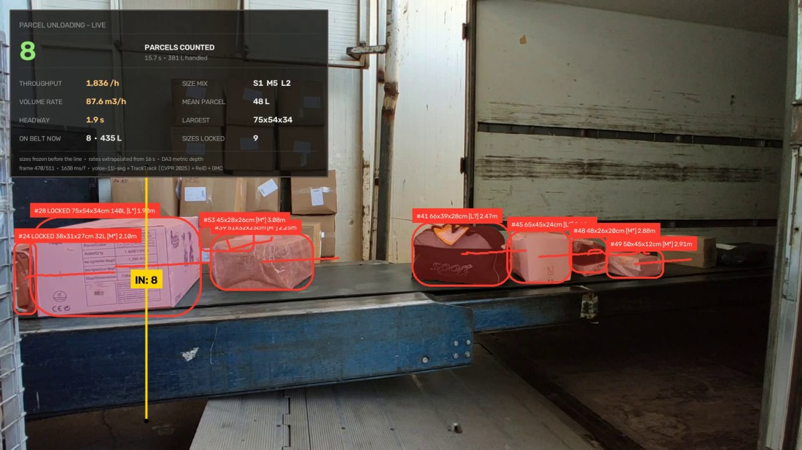

# Parcel Dimensioning — count, range and measure on an unloading belt

Counting a parcel is the easy half. The half a depot bills on is *how big it
was*, and a fixed camera cannot answer that from pixels alone — the same carton
covers four times the area at half the distance. This project adds metric depth,
fits the belt it all stands on, and reports millimetres **with the error budget
attached**.



*Frame 470 of 511, the eighth and last crossing. A label reads
`#track  LxWxHcm  [class]  distance`, and once the size is frozen it becomes
`#track LOCKED LxWxHcm  volume  [class]  distance` — so `#28 LOCKED 75x54x34cm
140L [L*] 1.90m` is a settled measurement, and `[L*]`/`[L?]` are the honesty marks
explained [below](#reading-the-size-class). The panel's figures are live at that
frame; the 21 parcels in the results below are the whole clip.*

## Result

| | |
|---|---|
| **Counted** | **8** crossings, 0 reverse — matching the slit-scan ground truth exactly |
| Dimensioned | 21 parcels, 1,087 L total, 37 L median |
| Rejected off the belt | 7,602 detections, on geometry rather than confidence |
| Belt-plane fit | 8.4 mm rms over 34,903 px; camera 488 mm above the belt |
| Intrinsics | fx 1372, fy 1367, hFOV 70.0°, square-pixel error 0.42 % |
| Calibration | ×1.226 from one printed carton; a second, unseen carton then reads 340.5 mm against a true 340 |
| Clip | 511 frames, 1920×1080 @ 29.97 fps |
| Speed | 1.6 s/frame detect, plus depth every 5th frame |

The count is checked against a **slit-scan** of the counting line's own pixel
column — one column per frame, stacked into an image, counted by hand. That is a
different measurement of the same event, not a restatement of the pipeline's
output, which is what makes 8 = 8 worth anything.

## Run it

```bash
python main.py                # count and measure
python main.py --count-only   # count only: no depth models, no sizes
```

Depth Anything 3 is the one dependency `main.py` cannot install for you (four
lines, below). It is checked for **before anything is downloaded**, and if it is
missing the run stops immediately and prints those lines — rather than fetching
2.9 GB of checkpoints and then raising `ModuleNotFoundError` from inside a model
constructor, several minutes into what looked like progress. `--count-only` is the
way to run the counting half meanwhile: it skips the depth checkpoints entirely
and falls back to the shared counting dashboard, because a panel with a SIZE MIX
row and nothing to put in it is the exact defect `panel.py` exists to prevent.

The heaviest of the collection to set up, and the rest of it automatic: two Depth
Anything 3 checkpoints (~2.9 GB) arrive alongside the detector on the first run.
They are cached afterwards — by Hugging Face, and per frame by the pipeline itself
in `output/.depth_cache` as float16 maps — so a second run costs a fraction of the
first. On the run that produced the figures above, **all 109 depth maps came from
the cache**, so no depth forward pass ran during the render at all; what remained
was 56 ms per map of disk read and resize. The intrinsics pass is not cached and
still costs one real forward (~54 s) at startup.

<details>
<summary>Python environment, including the Depth Anything 3 install</summary>

Python 3.11, CPU is enough:

```bash
pip install torch==2.9.1 torchvision==0.24.1 --index-url https://download.pytorch.org/whl/cpu
pip install ultralytics==8.4.106 supervision==0.29.1 opencv-python==5.0.0.93 lap PyYAML==6.0.1
```

Depth Anything 3 must go in **without its dependency list**. Its `pyproject` pins
`numpy<2` and pulls `opencv-python`, `xformers` and `open3d`, which between them
would downgrade numpy and OpenCV out from under everything else:

```bash
pip install --pre "omegaconf>=2.4.0.dev0"     # 2.3.1 needs antlr 4.9, which no
                                              # longer builds; the dev line works
                                              # with antlr 4.13
pip install --no-deps addict einops plyfile trimesh
git clone --depth 1 https://github.com/ByteDance-Seed/depth-anything-3
pip install --no-deps -e depth-anything-3
```

`depth.py` stubs `moviepy` and `pycolmap` at import time: DA3's export package
imports both at module scope for its Gaussian-splat and COLMAP writers, neither of
which this pipeline calls and neither of which builds against a current setuptools.

**Without DA3 installed**, `python main.py --count-only` still counts — that is
exactly the `run_case` call projects 01 and 02 make, with no backend and no
measurement.

Weights fetched on first run: `yoloe-11l-seg.pt`, `yolo11n-cls.pt`,
`depth-anything/DA3-LARGE` (camera intrinsics) and
`depth-anything/DA3METRIC-LARGE` (canonical metric depth). Clip:
[Pexels 5370836](https://www.pexels.com/video/unloading-packages-on-a-conveyor-belt-5370836/).

</details>

## How it works

Six models are in play, and each one has a module that owns it.

1. **Prompt and detect.** Five prompts, conf floor 0.05, YOLOE-11L-seg at 1280 px.
2. **Intrinsics** (`intrinsics.py`). DA3-LARGE's camera decoder predicts fx, fy —
   and the **square-pixel test** picks the processing resolution: 392 and 700 px
   make the decoder emit non-square pixels (8 % error), while 518 and 896 land at
   0.2–0.4 %. 896 is used. These are *predicted, not calibrated*: distance scales
   with them, size does not (see below).
3. **Metric depth** (`depth.py`). DA3METRIC-LARGE gives canonical depth; metres are
   `canonical × (fx+fy)/2 / 300`. Every 5th frame — parcels move 4.7 px/frame here,
   so 5 frames is 23 px of travel, well inside the mask — and each map is cached to
   disk (`depth_cache.py`).
4. **The belt plane** (`belt.py`). A plane is fitted to four bare stretches of belt
   spread across the view (a plane fitted from one corner extrapolates badly to the
   other, and parcels are measured at both ends). Two independent tests then decide
   whether a detection is *on the belt*: inside the depth corridor 1.45–3.20 m, and
   with its base within −0.10…+0.15 m of the plane.
5. **Size** (`sizing.py`). Mask + depth + plane → millimetres, plus how much to
   trust each one. Each parcel's size is **frozen once its centre passes x=520**,
   170 px before the counting line, so the number it is counted with is a settled
   median over the pass rather than whatever the last frame said.
6. **Count** (shared engine). The line is **plumb** at x=350, spanning y 400–1010.

### Why the line is plumb here and normal-to-motion elsewhere

What a counting line is supposed to be is a *vertical plane cut across the belt*.
On this lane the travel measures (−4.69, +0.27) px/frame because the belt recedes
as it crosses the frame, and the normal of that image motion comes out 3.3° off
plumb — a tilt that is perspective in the flow, not a property of the cut. A
vertical image line is the correct projection of that vertical plane whenever the
camera has no roll, and this one has none: the trailer's door post, the longest
plumb structure in view, measures −0.4° to 0.0°. So `line_plumb=True` snaps it
upright. Clips whose camera *is* rolled leave it off and keep the motion normal,
which is what projects 01 and 02 do.

### The line is at the near end on purpose

At x=350 the belt is 2.20 m from the camera against 2.90 m at the far end, and one
image pixel covers 1.6 mm of belt against 2.1 mm. **Measuring a parcel where it is
best resolved and counting it there is the same decision.** Any further left and
the trolley handle at x 230–330 starts cutting into the mask.

### One number of calibration, and what validates it

Monocular metric depth is scale-accurate to about 20 %, and no amount of geometry
fixes that because the error is in the depth itself. One reference object fixes it
for the whole installation — which is exactly how a dimensioning station is
commissioned on site, with a test carton.

This clip supplies its own: two cartons print `Ebat/Dimensions 720x500x340 mm` on
the side, legible in frame. Both ride flat on the 720×500 face, so their height
above the belt is 340 mm — and height is the one dimension a single camera sees
whole, base on the fitted plane and top against open air.

| | | |
|---|---|---|
| **calibrate** | white carton, 19 frames | height 277.4 mm measured → **×1.226** |
| **validate** | brown carton — a different object at a different place and time, never used to fit the scale | 277.8 mm measured, which the scale turns into **340.5 mm** against a true 340 |

That agreement says the scale **transfers between objects**. It does *not* say the
depth is unbiased: both cartons are the same model at similar range, so any
systematic error hits them equally. The honest per-frame error bar is the spread
within a single pass — the height wobbles by an IQR of 31 mm (11 %) frame to frame,
which is why every size is a median over the pass and never a single frame.

## Reading the size class

- `[M]` — **measured**: the camera resolved this parcel's top face.
- `[M*]` — the footprint came from a calibrated correction, good to about ±10 % on
  the long side and ±16 % on the short.
- `[M?]` — the longest side sits within that uncertainty of a class boundary.

**This is the honest core of the project.** A parcel's extent *away* from the
camera lives on its top face, and this lens rides 488 mm above a belt carrying
340 mm cartons — 125 mm above their lids. At 2.25 m a 500 mm top face spans **10
pixels**, and no algorithm recovers a depth extent from 10 pixels. The same camera
sees a 110 mm-tall bag's top over 38 px and measures it correctly.

Across the 21 parcels the top face resolves at **7.3 to 57.1 px**, and **19 of 21
footprints are estimated rather than measured**. Only two parcels — at 57.1 px and
38.0 px of top face — are measured outright:

| | measured | true | class | top face |
|---|:--:|:--:|:--:|:--:|
| brown carton | 689 × 465 × 366 | 720 × 500 × 340 | **L\*** | 10.0 px |
| white carton | 754 × 543 × 341 | 720 × 500 × 340 | **L\*** | 13.7 px |
| flat poly bag | 444 × 427 × 138 | ~420 long | **M** | 38.0 px |

Height is the trustworthy dimension. The footprint is not, and **the remedy is a
second view across the lane, not a better monocular model.** The correction is
applied *only* where the top face is under-resolved, because applying it
everywhere inflated the poly bag the camera had measured correctly — 444 mm became
527 mm and the bag jumped from M to L.

### The size mix, in full

| class | count | meaning |
|---|:--:|---|
| L | 1 | large, footprint measured |
| L\* | 3 | large, footprint corrected |
| L? | 3 | large, but within the uncertainty of the boundary |
| M | 1 | medium, footprint measured |
| M\* | 12 | medium, footprint corrected |
| S? | 1 | small, but within the uncertainty of the boundary |

Only the two unmarked rows have a footprint the camera resolved. The other 19 rest
on the correction: 15 show `*`, and the remaining 4 show `?` instead because
sitting within the uncertainty of a class boundary is the more serious caveat and
takes the mark. The read-out prints this per parcel, next to the `top px` column
it follows from, rather than in a footnote.

## What this does not measure

- **Not orientation, not fragility, not weight, not contents.** Three dimensions
  and a class.
- **Not every parcel's footprint** — see above; 19 of 21 rest on a correction.
- **Distance is only as good as the predicted intrinsics.** `fx`, `fy` come from
  DA3's camera decoder rather than a calibration target, so absolute distance
  carries their error. Size does not: the focal length cancels in
  `size = pixels × canonical ÷ 300`, which is why a predicted focal is acceptable
  for dimensioning and would not be for ranging.
- **The metric half does not survive the camera moving.** `SIZING` in `config.py`
  gathers everything that stops being meaningful the moment it does: the belt
  patches, the corridor, the two scales, the lock line.
- **Volume is a bounding box.** 1,087 L is the sum of L×W×H, not displaced volume.

## What is in this project

| | |
|---|---|
| `main.py` | entry point — the DA3 preflight, assets, run, report |
| `config.py` | `CLIP` (counting) and `SIZING` (metric), deliberately two objects |
| `assets.py` | the clip, the detector, and the two depth checkpoints (~2.9 GB) |
| `intrinsics.py` | DA3-LARGE's camera decoder, and the square-pixel test |
| `depth.py` | DA3METRIC-LARGE — canonical depth × focal ÷ 300 = metres |
| `depth_cache.py` | float16 maps on disk; the second run is nearly free |
| `belt.py` | the plane heights are measured against, and the on-belt test |
| `sizing.py` | mask + depth + plane → millimetres, and how much to trust them |
| `measurement.py` | the order of operations, and the contract with the counter |
| `panel.py` | the live dashboard — the only project of the three entitled to a size row |
| `report.py` | the read-out: measurement chain, per-parcel table, `*`/`?` legend |
| `input/`, `output/` | clip in; video, `summary.json` and the depth cache out |
| `docs/` | the still used in this README |

Every constant in `config.py` was measured rather than chosen, and the comment
beside it carries the measurement, so a number can be re-derived instead of
trusted. Two examples worth reading in place: the `styrofoam box` prompt (the last
container on the belt scored 0.098 as "parcel" — enough to clear the confidence
floor and the depth corridor, never enough to reach the tracker's spawn
threshold, so it existed in no output; naming the material took it to 0.580) and
the belt-motion vector (the previous −1.52 px/frame was measured over the whole
frame and dragged towards zero by the stationary stack, under-reading the speed
threefold).

## The shared engine, and what deliberately is not in it

The detector, tracker, counting rule and overlay renderer are shared with the two
counting-only projects:

```
factory_vision/
├── assets.py              downloader shared by every project
├── paths.py               where weights, clips and outputs go
├── tracking.py            TrackTrack config resolution
├── trackers/*.yaml        the tracker gates, retuned for zero-shot score ranges
├── tools/                 how the shared constants were arrived at
└── counting/
    ├── clips.py           ClipConfig — the per-clip contract
    ├── geometry.py        the counting line, the ROI, size gating
    ├── pipeline.py        detect → track → count → render
    ├── overlay.py         how to draw a panel (not what goes on one)
    └── measuring.py       the measurement protocol this project implements
```

**If you move this project into a repository of its own, `factory_vision/` has to
come with it**, at the same level as the project folder — `main.py` inserts its
parent's parent on `sys.path`.

**The metric half is deliberately not in there.** `depth.py` and `sizing.py` used
to sit in `factory_vision/counting/` alongside the shared counter — 619 lines that
neither counting project ever executes, in a package named for what the three have
in common — and `ClipConfig` carried eleven metric fields for the same reason, so
reading project 01 meant stepping over belt patches and footprint scales that have
nothing to do with oranges.

The measurement now reaches the counter through `measuring.py`, a `Protocol` the
shared pipeline calls when it is given a backend and skips entirely when it is not.
So "project 01 does not measure" is a structural fact — no torch depth model, no
checkpoints — rather than a flag that happens to be `False`. And `overlay.py` now
knows how to *draw* a panel and nothing about what belongs on one; each project
builds its own in `panel.py`, so this project's SIZE MIX and VOLUME RATE rows
cannot leak onto a citrus line again. They once did, for a whole 286-frame video.

## Credits

- Clip: [Pexels 5370836](https://www.pexels.com/video/unloading-packages-on-a-conveyor-belt-5370836/)
- Detector: [YOLOE](https://docs.ultralytics.com/models/yoloe/) (`yoloe-11l-seg`) with the MobileCLIP-BLT text encoder
- Tracker: [TrackTrack](https://openaccess.thecvf.com/content/CVPR2025/html/Shim_Focusing_on_Tracks_for_Online_Multi-Object_Tracking_CVPR_2025_paper.html) (CVPR 2025), via `ultralytics`
- Depth: [Depth Anything 3](https://github.com/ByteDance-Seed/depth-anything-3) — `DA3-LARGE` and `DA3METRIC-LARGE`
- Counting and annotation: [supervision](https://supervision.roboflow.com/)
