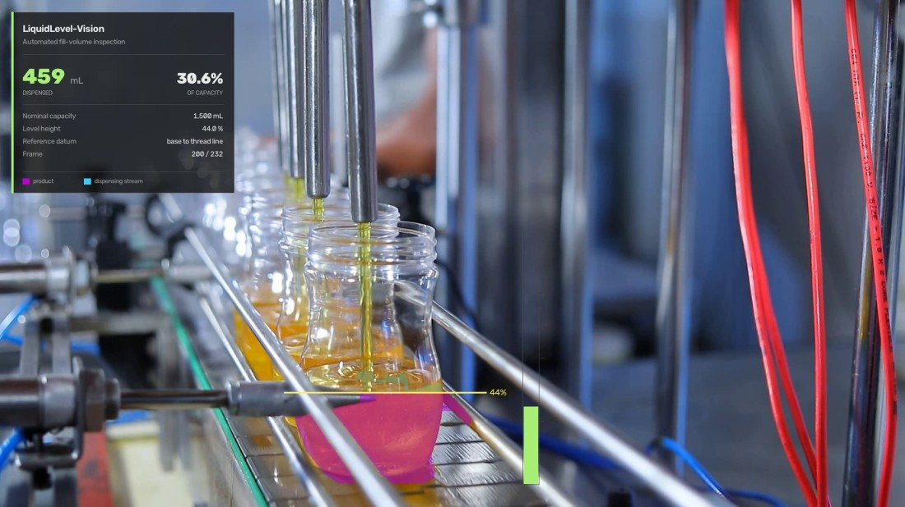
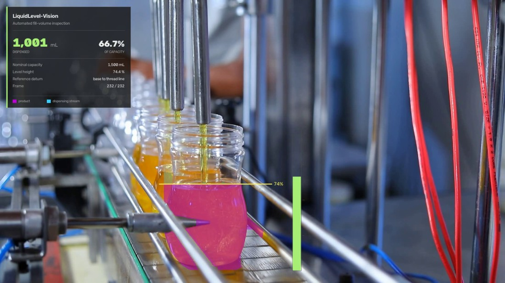

# Fill-Volume Inspection — how much product went into the bottle

Locate the liquid surface inside a bottle on a moving filler and integrate the
volume beneath it. No detector, no network, no training — colour and geometry.

| during the fill — 459 mL, 44 % | end of cycle — 1,001 mL, 74 % |
|---|---|
|  |  |

*Frames 200 and 232. Magenta is the product mask, the horizontal line is the
located surface with its height above the datum, and the bar at the right is fill
by volume. The two percentages differ on purpose: volume is not height. The same
rise in level adds a different amount of liquid depending on how wide the bottle
is there, which is why 74 % of the height comes out as 67 % of the capacity —
and why the volume is integrated over the measured bore instead of scaled from a
level.*

## Result

| | |
|---|---|
| **Dispensed volume** | **1,001 mL** |
| **Fill, by volume** | **66.7 %** — measured |
| Fill, by height | 74.4 % — measured |
| Nominal capacity | 1,500 mL — *configured per SKU, not measured* |
| Trajectory | monotonic; worst frame-to-frame step 3.1 %, no backward dip |
| Clip | 232 frames, 1920×1080 @ 25 fps |

The bottle is visibly **not full** at the end of this clip — the product stops
some 115 px below the thread line — and 66.7 % is the pipeline saying so. An
earlier version referenced the fullest level it happened to observe, which made
the last frame read 100 % by construction.

## Run it

```bash
python main.py                          # the calibrated station
python main.py --capacity-ml 1000       # a different SKU
python main.py --detect                 # also overlay live YOLOE segmentation
python main.py --video other_fill.mp4   # new footage from the SAME station
```

The clip is fetched on the first run into `input/`; the annotated video and
`liquid_level_summary.json` land in `output/`. This is the **only project of the
six that runs no neural network by default**, and by a wide margin the quickest.

<details>
<summary>Python environment</summary>

Python 3.11, CPU only:

```bash
pip install opencv-python==5.0.0.93 supervision==0.29.1 numpy
```

`torch` and `ultralytics` are needed **only** for the optional `--detect`
overlay. The measurement path imports neither.

The clip is pinned to the 1080p 25 fps rendition of
[Pexels 8720278](https://www.pexels.com/video/empty-bottles-in-a-filling-machine-8720278/)
by name, not left to the generic download endpoint: its default rendition is
3840×2160, and every pixel constant here was measured on the 1080p one.

</details>

## How it works

Three passes over the clip, in this order for a reason:

1. **`bore.learn` — fix the denominator.** The bottle's internal bore is measured
   per row from what the liquid actually reveals, across every frame, *before* any
   fraction is computed. Growing the denominator frame by frame makes the series
   non-monotonic and meaningless: an early version reported 72 % fill on the frame
   product first appeared, because it was dividing by the sliver of bottle wetted
   so far.
2. **`level.locate` + `level.deflicker` — find the surface, then trust physics.**
   The surface row per frame, then a median to kill splash spikes, an isotonic
   (non-increasing) fit because a filling level only rises, and a smoothing pass
   so the rate is physically plausible.
3. **`pipeline._render` — measure and draw** against the now-fixed reference.

### The four decisions that make it work

**Segment on saturation, not hue.** Product in direct view sits at `S 251–255`;
the same product seen *through* the glass of this bottle — from the bottles
standing behind it — sits at `S 104–199`. Their hues are nearly identical, so hue
cannot separate them and the `S ≥ 200` cut can. At `S ≥ 150` the final surface
read `y=652`; the real meniscus is `y≈690`.

**Find the surface by width, not by height.** The falling jet is a thin column
~3 % of the bore while standing liquid spans it, so the topmost lit pixel tracks
the *nozzle*, not the level. On frame 229 that put the line at `y=597` (mask 9 px
wide) when the surface was at `y=660` (146 px). So: start at the lowest lit row
and climb while each row spans at least 45 % of the bore there.

**Integrate the bore, not the mask.** Below the surface the bottle is full by
definition, so the true cross-section is the bore; a mask narrower than that is
glare or the machine's rod, not less liquid. The reading therefore depends only
on locating the surface, never on a pixel-perfect mask.

**Reference to the thread line.** A filler's nominal volume means "up to the
threads", not "to the brim" and not "the fullest this clip got".

### The ROI is anchored, not detected

YOLOE does find these bottles (`transparent bottle`, conf 0.78, masks included),
but on clear plastic its boxes wander 194–328 px and swap between neighbouring
bottles — a fill series built on them jumped 5 % → 60 % → 46 % and was
meaningless. Template matching shows the bottle itself moves **7 px** across the
whole cycle, so the window is measured once by hand and micro-aligned per frame
against the neck, which stays sharp and never fills.

`--detect` overlays the live detector so you can watch it run and judge that call
yourself. That is why it exists and why it is not the default.

## What is measured and what is typed in

| Reported | Status |
|---|---|
| fill fraction by volume | **measured** |
| fill fraction by height | **measured** |
| millilitres | nominal capacity **×** measured fraction |

No video can observe how big a bottle is. Pass the real SKU capacity and the
millilitre figure means something; the 1,500 mL default is illustrative. Getting
this backwards is the easiest way to report a confident wrong number, so the
console and the on-frame panel both say which is which.

Disc integration also assumes a solid of revolution — true for these round
bottles, false for a flask or a rectangular jerrycan.

## What breaks it

This is **a calibrated station, not a general model**. How far it tolerates a
moved camera is measured, not asserted —
`factory_vision/tools/perturbation_test.py` re-renders the clip with the framing
changed and runs the pipeline over it unchanged:

```bash
python -m factory_vision.tools.perturbation_test --sweep
```

| Framing | Volume | Fill | Error |
|---|---:|---:|---:|
| calibrated | 1,001 mL | 66.7 % | — |
| shift (+40, +20) | 1,026 mL | 68.4 % | +2.6 % |
| zoom ×1.08, shift (+60, +30) | 965 mL | 64.3 % | −3.6 % |
| zoom ×1.20, no shift | 928 mL | 61.9 % | −7.3 % |
| shift (+120, +60) | **143 mL** | 9.5 % | **−85.7 %** |
| shift (+220, +110) | **23 mL** | 1.6 % | **−97.7 %** |

**Translation kills it, not scale.** A 20 % zoom costs 7 %; a 120 px shift costs
86 %. The geometry constants are absolute coordinates, so a shift walks the
bottle out of the measuring window while a zoom about the frame centre leaves it
roughly where the constants expect. Re-mounting a camera in the right *position*
matters far more than matching the lens.

**The failure is a cliff, not a slope.** Up to ~60 px the reading is out by a few
percent — a range you could state a tolerance for. Past ~120 px it collapses to a
seventh of the true value, then a fortieth. There is no gentle middle to detect it
in.

**And every row above is reported through the same confident panel, with no error
flag.** That silence is the real hazard: nothing in the output says the
calibration no longer matches the scene. Treating that as the headline limitation
is the honest reading of this project.

Eleven constants in `calibration.py` are tied to this installation:

- **Absolute pixel geometry** — `ROI`, `THREAD_DATUM_Y`, `TEMPLATE_BOX`,
  `SURFACE_BAND`, and the eight-point `BOTTLE_OUTLINE`.
- **Colour tuned to this product and lighting** — `LIQUID_LO` (the `S ≥ 200` cut)
  and `LIQUID_LO_SHADOW`.
- **Scale-dependent thresholds** — `JET_MAX_WIDTH_PX` is in pixels so it moves
  with zoom; `POOL_MIN_RATIO`, `POOL_GAP_TOLERANCE` and `BORE_MIN_FRACTION` are
  tuned to this bore in this framing.

Plus the isotonic fit, which assumes **a single monotonic fill of one bottle** —
it will flatten a genuine fall in level, so it is wrong for footage that is not
one fill cycle.

Residual limits even in the calibrated case. The reported series has **no
backward step at all** (0 of 231 frame pairs fall, worst rise 3.1 %) — but that
smoothness is *imposed* by the isotonic fit, not observed: the raw per-frame
surface is noisy while the liquid is turbulent under the nozzle, and the fit is
what removes it. So monotonicity is not evidence the surface was located
perfectly on every frame, and a real fall in level could not appear even if it
happened. Separately, the ROI clips a little of the bottle's base bulge, so the
learned profile is slightly truncated; that affects the fraction only mildly,
because numerator and denominator are measured the same way, but it is not zero.

**To widen it**, in increasing order of work: express the pixel thresholds as
fractions of the measured bore (removes most of the zoom sensitivity);
recalibrate per station (~15 minutes — outline, thread line, band, one colour
sample); or derive the outline and colour from a bottle segmentation, which is
what `--detect` exists to let you evaluate.

## What is in this project

| | |
|---|---|
| `main.py` | the single entry point and the only command line |
| `calibration.py` | every constant tied to this station — the eleven above, each with the measurement behind it |
| `assets.py` | the clip, pinned to the 1080p 25 fps rendition |
| `roi.py` | holding the measurement window on the bottle against camera shake |
| `segmentation.py` | product mask and bottle silhouette, on saturation |
| `profile.py` | row widths, pool tops, the isotonic fit, disc integration |
| `bore.py` | pass 1 — the fixed bore, and the capacity it implies |
| `level.py` | pass 2 — the surface per frame, de-flickered |
| `pipeline.py` | the sequence, and pass 3's render |
| `panel.py` | the readout overlay |
| `report.py` | the console read-out |
| `input/`, `output/` | clip in; video and `liquid_level_summary.json` out |
| `docs/` | the stills used in this README |

Every module's docstring records the failure that shaped it — the bore learned
from splash, the surface that climbed into rows the liquid never reached, the
mouth diameter read off the outer rim that produced an inverted funnel. Those
notes are the reason the constants above are defensible rather than merely
present.

## Relationship to the rest of the collection

This project came out of a six-case monorepo and is the odd one out: the others
count or track objects with a zero-shot detector, and this one measures a
quantity with classical CV. It shares only two small helpers with them:

```
factory_vision/
├── assets.py     the downloader (progress bars, Pexels renditions)
├── paths.py      where weights, clips and outputs go
└── tools/perturbation_test.py    the framing sweep tabled above
```

**If you move this project into a repository of its own, those need to come with
it** at the same level as the project folder — `main.py` inserts its parent's
parent on `sys.path`. Nothing else in `factory_vision/` is used here; in
particular no detector, tracker or counting code is on the measurement path.

## Credits

- Clip: [Pexels 8720278](https://www.pexels.com/video/empty-bottles-in-a-filling-machine-8720278/)
- Optional detector for `--detect`: [YOLOE](https://docs.ultralytics.com/models/yoloe/) (`yoloe-11l-seg`)
- Frame I/O and video writing: [OpenCV](https://opencv.org/) and [supervision](https://supervision.roboflow.com/)
