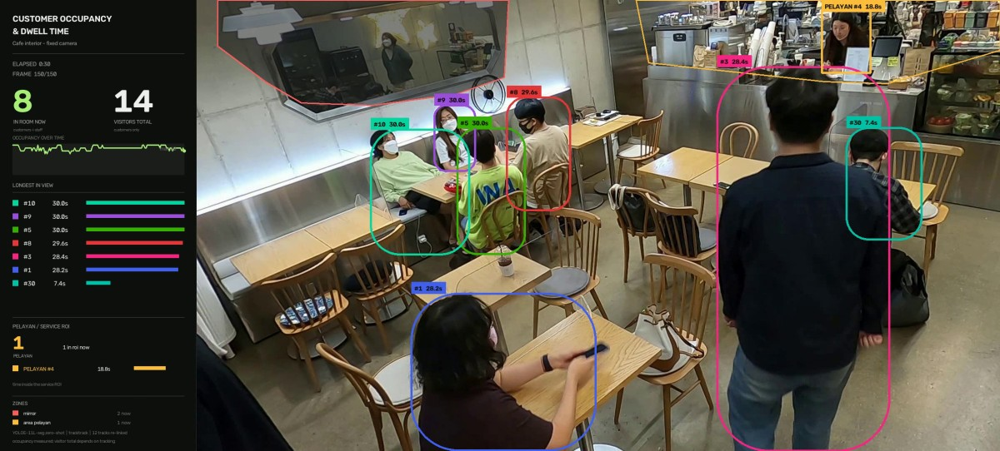
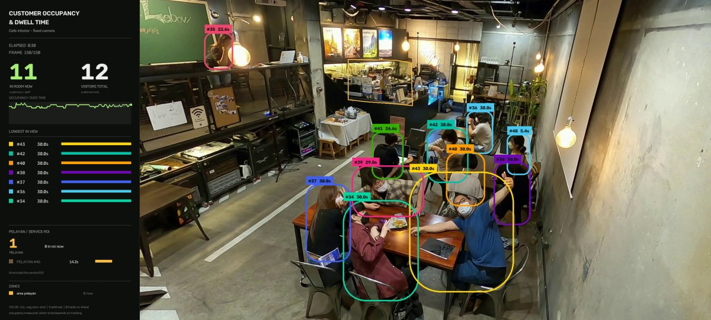

# Cafe Dwell Time — occupancy and per-person time in the room

Two rooms of the same cafe, one fixed overhead camera each. How many people are
in the room, how long each of them stayed, and how much of that was a server
working the counter rather than a customer sitting down.



*Last frame of scene 5. Each box carries `#id` and that person's time in view;
the strip on the left ranks them and separates the server's service time from
customer dwell. The red outline top-left is the wall mirror, excluded — see
[why](#why-the-mirror-is-excluded) — and the orange strip along the counter is
the service zone.*

## Result

| | scene 1 | scene 5 |
|---|:--:|:--:|
| **Distinct visitors** | 12 | 14 |
| Occupancy, mean / max | 10.32 / 12 | 8.96 / 10 |
| **Dwell, mean / max** | **24.64 s** / 30.03 s | **17.88 s** / 30.03 s |
| Staff service time | 14.21 s | 18.82 s |
| — of which observed | 38 frames | **88 frames** |
| — of which held through occlusion | **33 frames** | 6 frames |
| Server's share of the service zone | 100 % | 94 % |
| Detections before filtering | 1,611 | 2,016 |
| Duplicate boxes removed | 80 | 76 |
| Tracks split (drifted onto another person) | 0 | 10 |
| Tracks re-linked (broken by the tracker) | 0 | 12 |
| Service frames dropped as off-station | 0 | 12 |
| Tracks with gaps | **3 of 12** | 1 of 14 |
| Worst continuity | **0.152** | 0.750 |
| **Identity switches remaining** | 0 | **0** (was 9) |
| Speed | 1.24 s/frame | 1.21 s/frame |

Both rooms are measured by the same thirteen modules; only `config.py` differs,
and only in the zones. Every figure above comes from `output/*__dwell.json`.

## Run it

```bash
python main.py              # scene 5, the default room
python main.py --scene 1    # the other room
python main.py --all        # both, one after another
```

The two source clips are **already in `input/`** — see [Source clips](#source-clips)
for why this project is the exception — so a clean clone runs immediately. The
model weights are fetched on the first run; the annotated video and a JSON
summary per scene land in `output/`.

<details>
<summary>Python environment</summary>

Python 3.11, CPU is enough (~1.2 s/frame, so about three minutes per 150-frame
scene):

```bash
pip install torch==2.9.1 torchvision==0.24.1 --index-url https://download.pytorch.org/whl/cpu
pip install ultralytics==8.4.106 supervision==0.29.1 opencv-python==5.0.0.93 lap PyYAML==6.0.1
```

`ultralytics` ships both YOLOE and TrackTrack, and on the first `get_text_pe()`
call pulls the MobileCLIP text encoder (~572 MB) itself. Weights fetched on first
run: `yoloe-11l-seg.pt` and `yolo11n-cls.pt` (the tracker's re-identification
backbone).

</details>

## The two numbers are not equally good

**Occupancy is a detection result.** Count the people visible in a frame; no
identity required. It is the number to trust.

**Dwell time is a tracking result.** It needs one person to keep one ID while
someone walks in front of them. `tracks_with_gaps` reports how often that failed —
1 of 14 in scene 5, 3 of 12 in scene 1 — and the visitor total inherits the same
risk: a broken identity becomes two visitors who each stayed half as long.
`baseline.py` pins both, so a change that moves them says so on the next run.

Reporting them as though they were equally reliable is the failure this project
is built to avoid.

### Scene 1 is the harder room, and its numbers say so



*The second room, at the same instant of its clip. The service zone is outlined
along the counter and reads `0 in roi now` — the server is genuinely not visible
here, and `PELAYAN #46` is greyed rather than drawn on somebody else.*

Read two rows before quoting scene 1's dwell time.

**Its service figure is nearly half interpolated.** The counter sits deep in the
room, backlit by the menu boards, with equipment on the counter top cutting the
server in half. She is detected in 38 frames and held across 33 more, so at
4.995 fps her 14.21 s of service is **7.6 s observed and 6.6 s inferred**. Scene
5's server is detected in 88 of 94 frames — 17.6 s of 18.82 s observed. The held frames are reported separately in the JSON precisely so this
cannot be passed off as observation.

**Its identity assignment is much weaker.** Worst continuity 0.152 means one
customer was seen in 15 % of the frames between their first and last sighting —
the tracker lost them repeatedly, and re-linking joined none of it because the
gaps exceed what `identity.py` will bridge on appearance alone.

Occupancy is unaffected by either: it is a per-frame detection count, and
10.32 / 12 is as sound here as 8.96 / 10 is next door.

## How it works

Eight steps, of which **six are about identity rather than pixels** — which is the
shape of this problem. Occupancy falls out of detection alone; everything else
depends on one person keeping one ID through an occlusion, without the box
wandering onto the neighbour.

1. **Observe** — YOLOE-11L-seg prompted with `["person"]` at conf 0.25, then
   TrackTrack with re-identification and global motion compensation. Detections
   are filtered by zone, and each one gets an appearance descriptor.
2. **Split** — cut a track at any step where it jumped to a different person.
3. **Merge** — re-link tracks the tracker broke, with an overlap guard.
4. **Classify** — staff or customer, from time spent in the service polygon.
5. **Confine** — drop staff observations that are not at the station.
6. **Hold** — carry a staff identity through short occlusions, counted separately.
7. **Render** — the annotated video.
8. **Summarise** — the result record and its quality signals.

### Why identity needs this much work here

The clips run at **4.995 fps** — every 6th frame of a 29.97 fps recording. At ~5
fps a walking person crosses far more pixels between frames than a tracker's
motion model expects, so identity breaks in ways that never appear at 30 fps.
That frame rate is a property of the source dataset, not a choice, and it is the
entire reason `identity.py` exists.

### What the server in scene 5 cost to get right

She stands at the till for the whole clip while customers lean on the counter in
front of her: tracked for 19 frames, hidden for the next 51, picked up again for
the last 80. Four distinct defects came out of that, and all four are fixed.

**One person was put in two places.** The pairwise re-link rule refuses to join
tracks that coexist, but union-find joined them transitively anyway — two weak
matches (similarity 0.50 and 0.53) chained the server's track to three people
elsewhere in the room. The identity that came out was 15 % inside the service
polygon instead of her 68 %, so she was reported as a *customer* and the room
looked unattended for the first 70 frames. A union is now refused when any member
of one group shares a frame with any member of the other.

**A counter is not a room.** Her 10.4 s occlusion is far outside the 3 s gap that
suits a customer walking behind someone. A service polygon is a fixed workplace,
so two tracks that both sit predominantly inside one now get a longer gap and a
looser displacement allowance. She is one identity again, 94 % inside the zone,
labelled from frame 1.

The similarity floor moved 0.45 → 0.65 at the same time, and the value is not a
matter of taste: of the five candidate pairs in this clip, three score 0.82–0.98
and two score 0.50–0.53. The empty band between them is **0.286 wide, five times
the next largest gap**, and 0.65 sits in the middle of it.

**A track drifted onto another person, nine times.** The first two repairs left
the tracker's own errors untouched. Auditing every step *within* each track found
nine — the worst being track #7, whose box left the counter at f6 and reappeared
at f23 on somebody at the far right of the room, 1.06 body widths away with its
colour correlation collapsed to 0.41. The old metric compared consecutive frames
only, so a switch across an occlusion scored clean.

`split_switched_tracks` cuts a track at such a step, and its threshold is
measured: over 1,333 within-track steps the 5th percentile of colour correlation
is 0.798 and the 1st is 0.585, so **0.55 splits the most extreme half-percent and
nothing else**. A displacement is additionally required on adjacent frames,
because a person turning their back drops the hue histogram on its own and
splitting there would invent a person out of a pirouette.

Split runs *before* merge, and the pair is self-correcting: three of the ten
splits were rejoined by the merge step at aggregate similarities of 0.81–0.91,
because those two halves did look alike over their whole lives even though one
step between them did not. Only splits that survive that test change the answer.

| | before | after |
|---|:--:|:--:|
| Identity switches | **9** | **0** |
| Server's zone share | 94 % over 93 frames | 94 % over 100 frames |
| Server's box on the wrong person | frames 8–19 | **none** |
| Tracks with gaps | 2 of 12 | **1 of 14** |
| Distinct visitors | 12 | 14 |

**And the box slid, which no step-wise test catches.** Even after the split, the
PELAYAN box left the server between f8 and f19 and settled on the customer in
front of her. There was no jump to find: it *grew*, from 127×166 at f1 to
197×601 by f15, swallowing him a few pixels at a time. Every step was innocent —
displacement 0.03–0.26 body widths, colour correlation 0.81–0.94, because she
wears black and so does he.

`roles.confine_to_station` fixes it with a domain fact rather than another pixel
threshold: **a station worker is at the station.** An observation is kept only if
it is inside the service polygon *and* still her size. The polygon alone was not
enough — the zone is a wide strip along the top of the frame, so the growing box
kept its centre inside it for six more frames. Her in-zone height holds 163–172 px
for the first seven frames and jumps to 270–347 during the drift, and **every
growth gate from 1.3× to 1.6× drops exactly the same six observations**, so 1.5×
is not a tuned number.

This also repaired a claim the panel had been making falsely. It has always been
captioned "time inside the service ROI" while `render.py` counted *every* frame of
the staff identity, off-station ones included. The figure now means what the
caption says, which is why service time reads 18.82 s rather than 21.22 s.

### Why 14 visitors is the fix and not a regression

Two of the fourteen are ~1.2 s glimpses — one is a second person behind the
counter for six frames at the start. Those frames used to be glued onto *other
people's* tracks, inflating their dwell times. Reattaching them to whoever they
actually show is the honest outcome, and it is also why the dwell mean falls to
17.88 s: that is arithmetic over fourteen entries, two of them a second long, not
a loss of accuracy. If a one-second glimpse should not count as a visit at all,
the gate for that is `min_track_age` in `config.py` — a deliberate decision about
what "visit" means, not something to hide inside the tracker.

## Why the mirror is excluded

A cafe mirror produces people who are genuinely there, in the image, and
genuinely not in the room. No confidence threshold separates a reflection from a
customer, because the reflection *is* a customer — just counted twice. The
exclusion zone is in `config.py` with the reason written beside it, and it is
drawn on the frame so the viewer can see what was removed. Scene 1 has no mirror
and therefore no such zone.

## What is not fixed

For the ~50 frames the scene-5 server is hidden behind customers she is not
separately detected, so she carries **no PELAYAN box there** — correctly, she is
not visible. The in-zone detections in that stretch belong to the tall customers
at the counter, whose box centres fall inside the polygon and whom the 60 % share
gate correctly keeps as customers.

Four alternative tracker settings were measured against that occlusion — heavier
ReID, a longer track buffer, a looser match threshold — and **each traded it for a
worse defect**, either splitting her in two again or losing a visitor. The gap is
reported (`frames_held`, `tracks_with_gaps`, `worst_continuity`) rather than
papered over.

Also out of scope by design: no faces, no re-identification across the two rooms,
no demographics. A person leaving scene 5 and entering scene 1 is two visitors,
and nothing here claims otherwise.

## What is in this project

| | |
|---|---|
| `main.py` | entry point — `--scene`, `--all` |
| `config.py` | per-room zones: the mirror to exclude, the service polygon |
| `assets.py` | what has to be present before a run |
| `zones.py` | frame regions that are not ordinary customers — geometry only |
| `detection.py` | pass 1 — detect, filter by zone, track, describe |
| `identity.py` | splitting tracks that drifted onto another person, and re-linking the ones the tracker broke |
| `roles.py` | staff or customer, and keeping a station worker at their station |
| `render.py` | pass 2 — the annotated video |
| `overlay.py` | the readout strip and the box tags |
| `summary.py` | the result record and its quality signals |
| `pipeline.py` | the eight-step sequence, and nothing else |
| `baseline.py` | each room's last verified figures, checked on every run |
| `report.py` | the console read-out, including the regression line |
| `input/`, `output/` | the two pre-cut clips, and the results |
| `docs/` | the stills used in this README |

## Source clips

The two clips in `input/` are **committed to the repository**, which is unusual
and deliberate. The source is the [CAFE dataset](https://dk-kim.github.io/CAFE/),
distributed as a single ~150 GB Google Drive archive with no API, which no
`main.py` can reasonably pull. Without the two cuts in the repository, `python
main.py` fails on a clean clone. 47 MB is the price of the project being
runnable.

Each is 150 consecutive frames of a 29.97 fps recording, every 6th frame kept —
4.995 fps, 30.0 s.

> CAFE is credited to its authors at the link above. If you redistribute this
> project, check the dataset's own licence terms rather than relying on this note —
> the project page states CC BY-SA 4.0 for the site and is less explicit about the
> data itself.

## The shared engine

This project uses a small shared package that lives outside this folder:

```
factory_vision/
├── assets.py         the downloader (progress bars, weight and clip placement)
├── paths.py          where weights, clips and outputs go
├── detect.py         YOLOE, the tracker view, and contained-box suppression
├── tracking.py       TrackTrack config resolution
└── trackers/*.yaml   the tracker gates themselves
```

Those five, and nothing else — `detection.py` imports `DetView`, `build_tracker`
and `suppress_contained` from `detect.py`, and `resolve_tracker_cfg` from
`tracking.py`, which reads the YAML.

**If you move this project into a repository of its own, `factory_vision/` has to
come with it**, at the same level as the project folder — `main.py` inserts its
parent's parent on `sys.path`. The counting code in `factory_vision/counting/` is
*not* used here: this project counts nothing across a line, so it has its own
`detection.py`, `render.py` and `overlay.py`.

The tracker configuration is the one tuned for 30 fps conveyor footage, reused
unchanged at 4.995 fps. That mismatch is deliberate — it is what exposed the
identity failures documented above, and the repairs live in this project rather
than in the shared tracker settings, because they are facts about a cafe with a
service counter, not about tracking in general.

## Credits

- Footage: [CAFE dataset](https://dk-kim.github.io/CAFE/) — scenes 1 and 5
- Detector: [YOLOE](https://docs.ultralytics.com/models/yoloe/) (`yoloe-11l-seg`) with the MobileCLIP-BLT text encoder
- Tracker: [TrackTrack](https://openaccess.thecvf.com/content/CVPR2025/html/Shim_Focusing_on_Tracks_for_Online_Multi-Object_Tracking_CVPR_2025_paper.html) (CVPR 2025), via `ultralytics`
- Annotation: [supervision](https://supervision.roboflow.com/)
