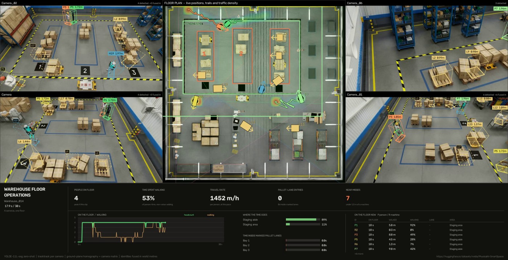

# Warehouse 3D — four cameras, one floor plan, people in metres

Four fixed cameras watching one warehouse floor. Each sees flat 2D boxes; the
output is a single eagle-eye plan with **one identity per person, positioned in
metres** — and, uniquely in this collection, an accuracy figure scored against
the dataset's own 3D ground truth rather than argued for.



*Frame 180 of 300. Four camera tiles, the floor plan in the middle with live
positions, trails and traffic density, and the operations strip beneath. Every
box carries its subject's height in metres — the one dimension a single camera
can solve in closed form.*

## Result

| | |
|---|---|
| **Localisation error** | median **0.181 m**, mean 0.245 m, p95 0.519 m |
| **Recall** | **0.9822** — 884 of 900 ground-truth person boxes, inside a 1 m gate |
| Precision | 0.7367 — see [the weak number](#precision-is-the-weak-number) |
| **Identity** | **1.0 global IDs per real person** — no fragmentation |
| Cross-camera agreement | 0.232 m between views of the same person |
| On the floor | 4 people, 3 machine identities, 7 pallet loads |
| Floor use | staging aisle 75.0 %, staging area 25.0 % |
| Proximity | 12 near-miss events under 1.5 m, 2.1 s total, closest **0.44 m** |
| Clip | 300 frames, 30 s of a 12-camera recording, 4 views used |
| Speed | 2.8 s/frame for four views, CPU-only |

**The ground truth is read only at the end, to score.** Detection, lifting and
fusion never see it. That is what separates this project from the other five:
its accuracy is measured, not reasoned about.

## Run it

```bash
python fetch_scene.py          # once: scene, calibration, ground truth (~520 MB)
python main.py                 # the four-camera floor
python main.py --max-frames 60 # a quick look
python main.py --scene warehouse_014_full   # all twelve cameras
```

**The model weights download themselves** on the first run, with a progress bar.

**The scene is a separate, deliberate step.** `fetch_scene.py` pulls one
recording from NVIDIA's PhysicalAI-SmartSpaces dataset on Hugging Face and cuts
the twelve camera clips, the calibration and the 3D ground truth out of it. It is
not folded into `main.py` because it is ~520 MB and because the calibration and
truth files are the reason this case can be scored at all — worth fetching
knowingly rather than as a side effect.

<details>
<summary>Python environment</summary>

Python 3.11, CPU is enough:

```bash
pip install torch==2.9.1 torchvision==0.24.1 --index-url https://download.pytorch.org/whl/cpu
pip install ultralytics==8.4.106 supervision==0.29.1 opencv-python==5.0.0.93 lap PyYAML==6.0.1
```

`ultralytics` ships YOLOE and TrackTrack, and pulls the MobileCLIP text encoder
(~572 MB) itself on the first `get_text_pe()` call. `fetch_scene.py` additionally
needs `huggingface_hub`.

</details>

## How a flat box becomes a place in metres

One assumption does the work: **the bottom edge of a box is where the object
meets the floor.** Back-project that point through the ground-plane homography
and the result is a position in metres.

Height then follows in **closed form**. A standing person is a vertical segment,
and the camera matrix makes the image row `v(h)` a Möbius function of height —
invertible exactly, with no search and no second view. The median person here
solves to **1.89 m**.

### The assumption fails three ways, and each is handled on its own terms

| Box clipped by | What breaks | What happens |
|---|---|---|
| the **bottom** of frame | the feet are not visible, so the floor point is wrong | the observation is dropped |
| a **side** | the feet are still there; only the horizontal centre shifts | kept, at reduced weight |
| the **top** | only the height is lost | kept; the position is unaffected |

Lumping these together as "box touches the edge, discard" throws away good
positions. Over this clip the split matters: 77 observations went for feet below
frame, while side- and top-clipped ones survived.

### Then fuse, and require corroboration

Each camera tracks independently; identities are merged in world space inside a
**0.9 m radius**. An identity seen by only one camera is **dropped** — 4 were —
because a single view cannot be cross-checked and this floor always has at least
two cameras covering it. 1,681 observations merged, and the two views of the same
person agree to **0.232 m**.

## Precision is the weak number

Recall is 0.9822 and localisation is 0.181 m. Precision is **0.7367**, and the
shape of the error is specific rather than diffuse:

| | |
|---|---|
| ground-truth person boxes | 900 |
| person boxes reported | **1,200** |
| matched inside the 1 m gate | 884 |
| false positives | 316 |
| count error per frame | **+1.0** mean, exact in only 4 of 300 frames |

That is not scattered noise. It is **one persistent extra person**, present in
almost every frame — `distinct_people` reads 4 where the ground truth in view has
3. A zero-shot `person` prompt on a warehouse floor also fires on the humanoid
robot working there, and nothing in the output distinguishes them.

So: trust the **positions** and the **identity count per real person**; treat the
**headcount** as an upper bound until the person/humanoid split is resolved. The
prompts already name `humanoid robot` separately, which is where a fix would
start.

## The bug worth reading about

Every marker sat in the wrong half of the building for several iterations — and
the **positions were never wrong**, 0.18 m against ground truth throughout. Only
the *picture* was: the map ↔ world transform had its y axis mirrored.

Mirrored points still land inside the building, so nothing looked broken. No
assertion fires, no number moves, and the error survives any amount of staring at
the floor plan. It was caught by projecting the floor plan's own painted bay
outlines back into a camera image and watching them miss by half a warehouse —
a check against something physical rather than against the pipeline's own output.

## What this does not measure

- **Not who.** No faces, no re-identification across sessions. An identity lasts
  as long as the clip.
- **Not the headcount, reliably** — see above.
- **Not pose or activity.** "Walking" means a straight-line world speed above
  0.15 m/s over a 0.6 s window, and nothing finer.
- **Rates are extrapolated from 30 seconds.** 1,452 m/h of travel comes from
  41.2 m walked in half a minute; the panel prints the sample beneath the rate,
  and the 8-hour figures in the JSON carry the word *caveat* in the payload.
- **The calibration belongs to this scene.** Camera matrices, the ground
  homography and the floor zones all come from the dataset. Another warehouse
  needs its own.

## What is in this project

| | |
|---|---|
| `main.py` | entry point — `--scene`, `--max-frames`, `--progress` |
| `fetch_scene.py` | downloads the scene and cuts the clips, calibration and truth |
| `config.py` | the two scenes: cameras, floor zones, per-class dimensions, clip window |
| `calibration.py` | camera matrix, ground homography, the closed-form height solve |
| `bev.py` | the eagle view's world ↔ map transform |
| `lift.py` | one 2D box → a place and a height in metres |
| `fuse.py` | one global identity per person, across cameras |
| `analytics.py` | zones, speed, proximity, and the ground-truth scoring |
| `render.py` | 3D wireframes, the floor plan, the operations panel |
| `pipeline.py` | four views per frame, fused and drawn |
| `factory_vision/` | the vendored shared modules — see below |
| `input/`, `output/` | the fetched scene, and the video plus `warehouse_014__spatial.json` |
| `docs/` | the still used in this README |

## The engine, vendored

This project is self-contained: every module it imports is in this folder.

```
06_warehouse_3d/
├── main.py, fetch_scene.py, config.py, calibration.py
├── bev.py, lift.py, fuse.py, analytics.py, render.py, pipeline.py
├── factory_vision/
│   ├── assets.py         the weight downloader
│   ├── detect.py         YOLOE in the shape the tracker wants
│   ├── tracking.py       TrackTrack config resolution
│   ├── trackers/*.yaml   gates retuned for zero-shot score ranges
│   └── paths.py          where weights, input and output live
└── input/  output/  docs/
```

It came from a monorepo of six cases where one copy of that package served all of
them. A shared package cannot travel into six separate repositories, so each
carries its own — at the cost of a tracker fix now needing to be applied in each
place rather than once.

The counting engine those other projects use is **not** here: this case never
counts a line crossing. It drives the tracker directly, per camera, and does its
own work in world coordinates.

## Credits

- Scene, calibration and 3D ground truth: [NVIDIA PhysicalAI-SmartSpaces](https://huggingface.co/datasets/nvidia/PhysicalAI-SmartSpaces),
  MTMC_Tracking_2025 / train / Warehouse_014 — **CC BY 4.0**
- Detector: [YOLOE](https://docs.ultralytics.com/models/yoloe/) (`yoloe-11l-seg`) with the MobileCLIP-BLT text encoder
- Tracker: [TrackTrack](https://openaccess.thecvf.com/content/CVPR2025/html/Shim_Focusing_on_Tracks_for_Online_Multi-Object_Tracking_CVPR_2025_paper.html) (CVPR 2025), via `ultralytics`
