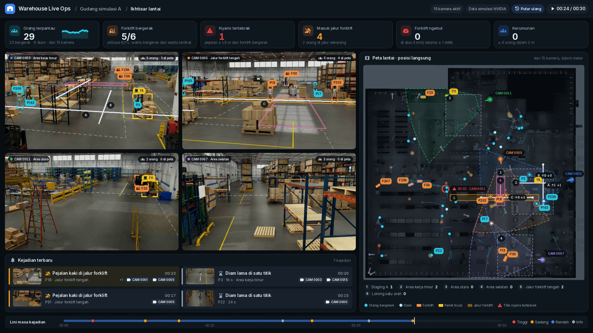
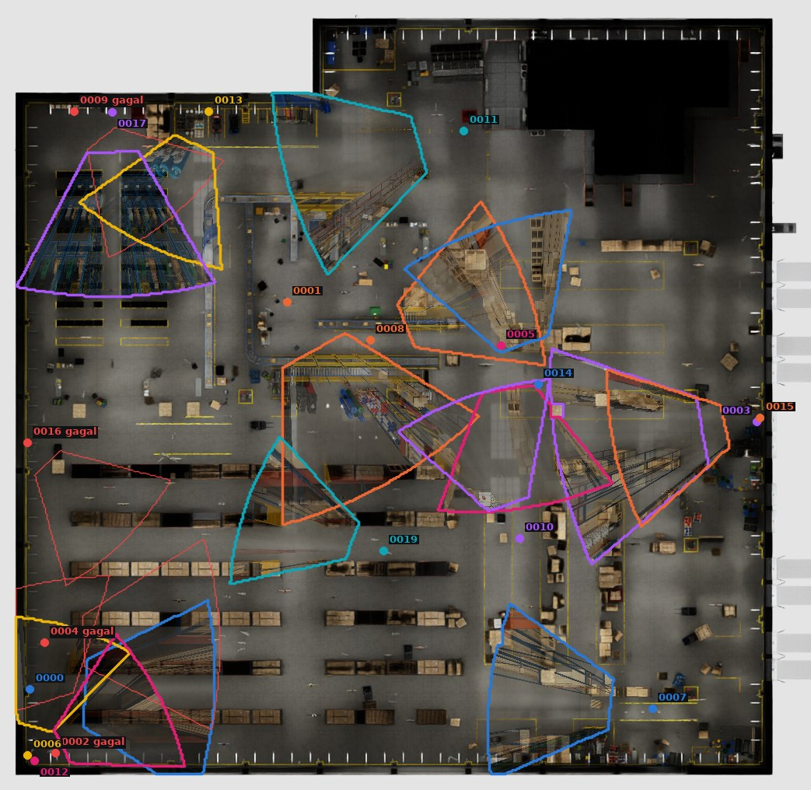
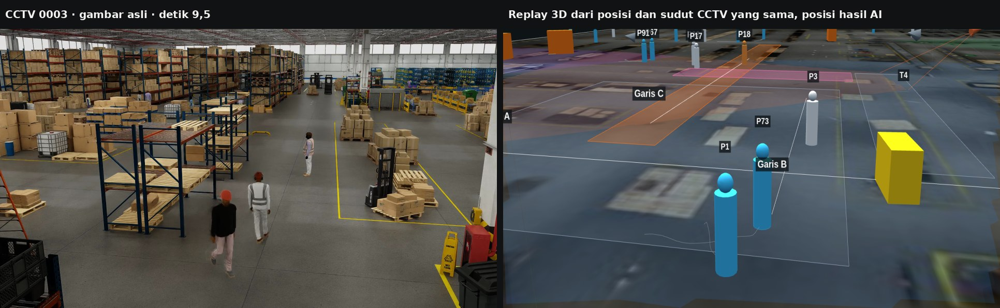
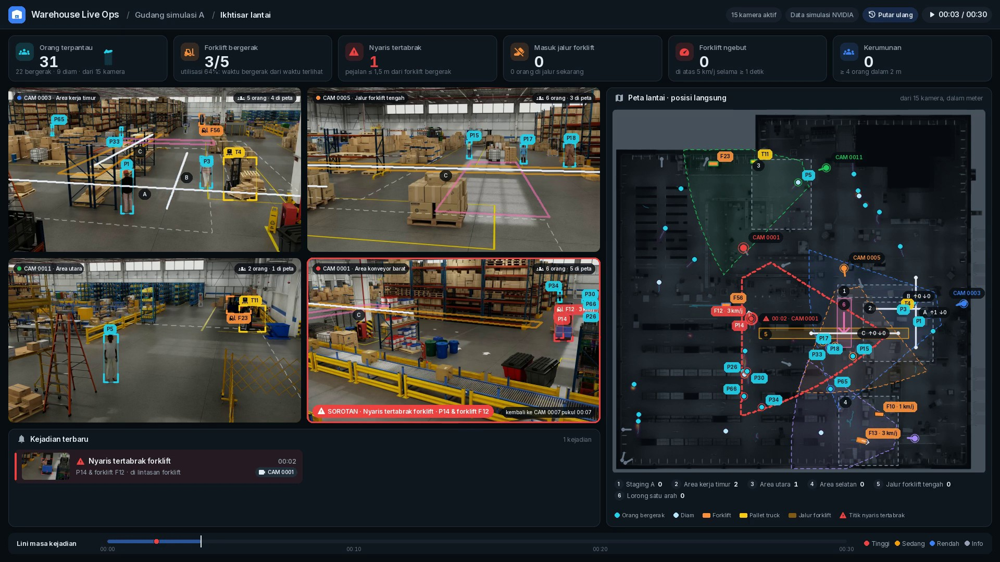
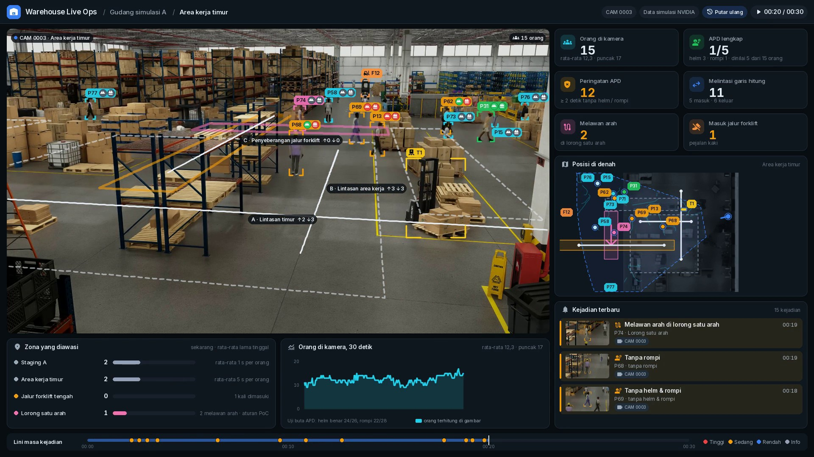
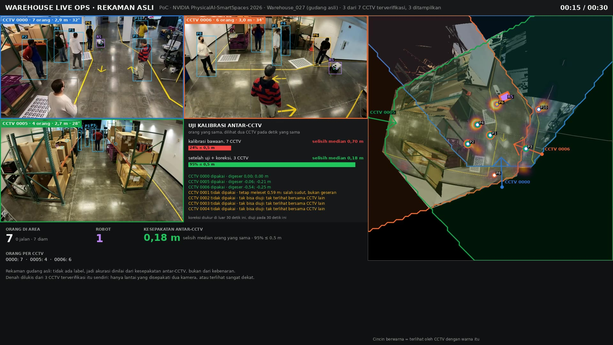
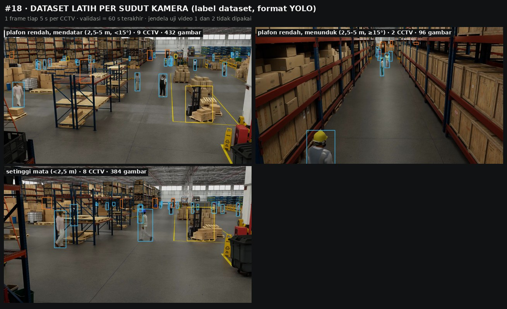
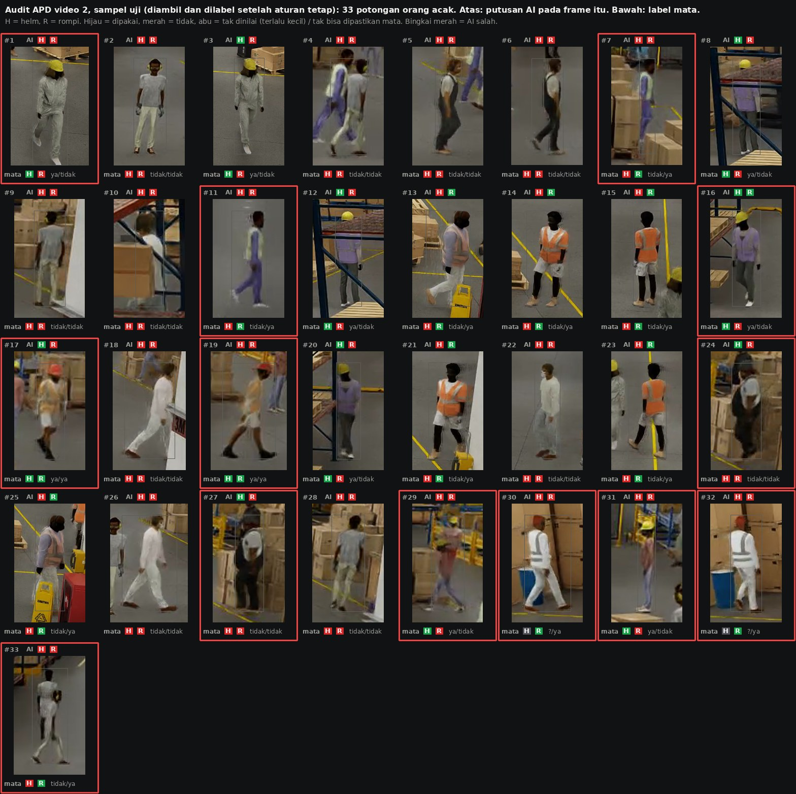
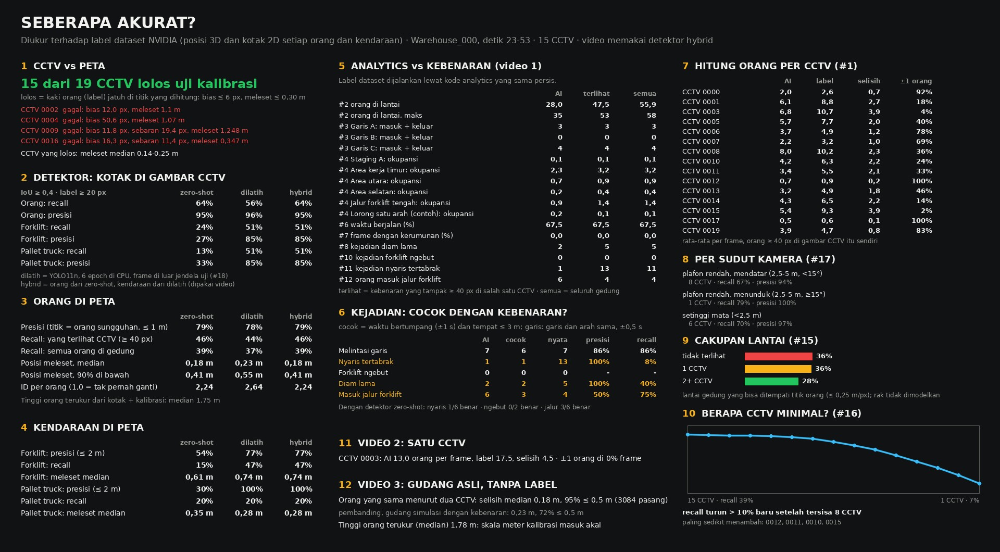

# Warehouse Live Ops — one floor plan, drawn live from every CCTV

A warehouse with fifteen ceiling cameras has fifteen pictures and no map. This
project turns them into one: every person, forklift and pallet truck the cameras
see is placed on the floor plan **in metres**, followed as one identity from
camera to camera, and turned into the numbers an operations floor runs on —
headcount, zones, counting lines, congestion, idle time, forklift use and speed,
near misses, people in the forklift lane. Every one of those numbers is then
checked against the dataset's own ground truth, computed by the same code.
Videos 2 and 3 also follow each person's helmet and vest; the data has no
labels for those, so they are checked by eye on crops labelled before the AI
was scored (#21).



*Video 1, second 24. The cards are what an owner checks first: 29 people on the floor, 5 of 6 forklifts moving (62 % of their time so far), the window's one near miss, 4 entries into the forklift lane — P18 and P202 are in it now, orange in CAM 0005's picture and on the plan, and the zone list under the plan says 2 as well. Every alert names the camera that saw it and carries its snapshot; the near miss of second 2 was seen only by CAM 0001, which is not one of the four on screen, so the plan marks its spot with that camera, and while it happened CAM 0001 was called up into the fourth tile ([below](#what-the-owner-sees)). In the pictures every person a camera follows is boxed: named and coloured when they are on the plan, grey when they are too far from that camera to place precisely — "5 orang · 3 di peta" counts both. On the plan, a person is a dot (cyan walking, pale standing), a forklift an orange block; the thin coloured ring says which camera on screen sees them.*

## Result

Warehouse_000 is a simulation with full ground truth, so every figure below
is a measurement, not an estimate; helmet and vest, which its labels do not
cover, are measured against labels made by eye. 30 seconds (the busiest of the
recording), 15 cameras, 10 analysed frames a second.

| | |
|---|---|
| **Cameras usable** | **15 of 19** pass the calibration test; 4 are rejected and used nowhere |
| **People on the plan** | **79 %** of the dots are a real person (within 1 m); median position error **0.19 m**, 90 % within 0.41 m |
| **People found** | 46 % of the people a camera shows at least 40 px tall, 39 % of everyone in the building: the detector is the limit, not the geometry |
| **Counting lines** | 6 crossings on three lines, all of them real: the same crossing, same direction, within 0.5 s, as 6 of the ground truth's 7 |
| **Walking vs standing** | 67.4 % of the time walking; ground truth 67.5 % |
| **Forklifts on the plan** | found 46 %, precision 77 % with the site-trained detector (zero-shot alone: 16 %, 55 %); speed within 0.37 km/h (median), 1.6 km/h for 90 % |
| **Forklifts moving** | moving or standing, right **80 %** of the time; utilisation (share of forklift time moving) **62 %** against 55 % true |
| **Names that stay** | a person or forklift in the four camera pictures changes its name 46 times in 30 s, down from 81 ([how](#names-that-stay)) |
| **False alarms** | speeding 0 (truth 0) · crowds 0 (truth 0) · near miss: 1 raised, and it is real |
| **Missed** | 12 of 13 real near misses: the person stands inside the forklift's outline in the picture and is not detected |
| **Real warehouse** | 3 of 7 cameras verified; they place the same person **0.18 m** apart (0.70 m as shipped) |
| **Metric scale** | people measured at 1.75 m (simulation) and 1.78 m (real) from box and calibration alone |
| **Helmet / vest (#21)** | on random crops labelled by eye before the AI was scored: helmet right 24 of 26, vest 22 of 28 in the simulation; 24 of 24 each in the real warehouse, where nobody wears either and the AI claims a vest on 0.9 % of 5,100 crops (38 % without its CLIP check) |
| **Speed** | 0.45 s per camera frame on 4 CPU cores for people (YOLOE), 0.035 s for vehicles (YOLO11n); not real time on a CPU |

## The one rule: the plan shows where the camera's people really are

A dot on the plan that is not where the person in the picture stands is worse
than no plan. Five things make sure it is — and let anyone check it.

1. **Every camera is tested before it is used.** The dataset knows where every
   person really stands. For each camera, the real foot position of every
   labelled person whose whole body is in the picture is projected into the
   image and compared with the bottom of their labelled box. A camera passes when
   they agree: bias at most 6 px, spread at most 5 px, floor error at most
   0.30 m. **15 of 19 pass.** The four that fail are used nowhere.
2. **The real warehouse's cameras are checked against each other.** It has no
   ground truth, so a camera is checked against where the *other* cameras put
   the same person at the same instant. As shipped they disagree by 0.70 m
   (median; only 24 % of pairs within 0.5 m). Most of that is a constant shift
   per camera, which `align_real.py` measures on the seconds the video does not
   show and corrects; cameras that still disagree afterwards, or cannot be
   checked, are not used.
3. **The published homography of the real recording is not trusted.** It
   differs from the projection matrix by three orders of magnitude and puts the
   floor behind some cameras. The floor plane is always rebuilt from the
   projection matrix: `H = P[:, [0, 1, 3]]` (`scene.py`).
4. **Same colour and same name in the picture and on the plan.** Each camera on
   screen has one colour: the dot before its name, its field of view on the plan
   (dashed), its marker, and a thin ring around every dot it currently sees. A
   person is `P12` in the picture and `P12` on the plan, a forklift `F3`. Boxes
   that could not be placed (feet out of frame, too far away) stay visible, as
   faint grey corners without a name.
5. **The 3D replay can stand where a CCTV hangs.** "Dari CCTV …" in
   `replay_3d.html` puts the 3D eye at that camera's calibrated position, looking
   where it looks with its own field of view and picture shape.



| Camera | Verdict | Why |
|---|---|---|
| CCTV 0002 | rejected | feet land 12.0 px off, 1.10 m on the floor |
| CCTV 0004 | rejected | 50.6 px off sideways: its calibration does not match its picture (the boxes do) |
| CCTV 0009 | rejected | 11.8 px off and 19.4 px of scatter, 1.25 m; half the people it sees are hidden |
| CCTV 0016 | rejected | 16.3 px off and 11.4 px of scatter, 0.35 m |

The fifteen that pass place a labelled person's feet 0.15–0.25 m from
where they really stand (median per camera).



*Left: CCTV 0003 at second 9.5. Right: the 3D replay from CCTV 0003's calibrated
position and field of view, built only from the floor positions the pipeline
computed. The two people in the foreground, the person standing by the pallets
and the pallet truck (yellow) are where they are in the picture.*

## What is here

| Output | What it shows | Made by |
|---|---|---|
| `output/warehouse_000/video1_live_ops.mp4` | **Video 1 · site overview.** The owner's cards (people, forklifts moving and their utilisation, near misses, forklift lane, speeding, crowds), 4 of the 15 verified CCTV, the whole floor live, the alerts with a snapshot each, the timeline. 30 s, the busiest of the recording | `main.py` |
| `output/warehouse_000/video2_one_camera.mp4` | **Video 2 · one camera.** The east work area's camera large: people in view, PPE (#21), counting lines, wrong-way walks, the zones it watches and how long people stay, its own plan, alerts and timeline | `main.py` |
| `output/warehouse_027/video3_real.mp4` | **Video 3 · real warehouse.** The three verified real cameras, one identity per person across them, a list of everyone in the area with their helmet and vest, the robot, alerts and the system's own health; no floor plan ([why](#why-video-3-has-no-floor-plan)) | `main.py` |
| `docs/accuracy_report.jpg` | Every number above, measured against the ground truth | `report.py` |
| `docs/ppe_audit_video*_check.jpg` | #21 · helmet and vest, the AI against the eye on random crops | `ppe.py --audit` |
| `weights/ppe_detector/` | #21 · the helmet / vest detector, fine-tuned on the CPU | `ppe.py --train` |
| `output/warehouse_000/replay_3d.html` | #20 · the 30 s of video 1 in 3D, viewable from each CCTV | `replay_3d.py` |
| `search_events.py` | #19 · questions in Indonesian → the moments, with video time and the CCTV that saw them | — |
| `output/training_sets/` | #18 · a YOLO training set per camera angle, from the labels | `export_dataset.py` |
| `weights/site_detector_warehouse_000/` | #18 · a detector fine-tuned on it, on the CPU | `train_detector.py` |
| `output/*/video*.json` | every figure behind the videos, with its truth comparison | `main.py` |

Videos, training sets and model weights are rebuilt by the scripts and kept out
of git; the cached detections and helmet / vest evidence are committed, so
everything after them reruns in minutes.

## What the owner sees

The three videos are laid out as one operations dashboard, in Indonesian, with
the same parts in each (`videos.py`, `ui.py`, `ops.py`):

| Part | What it is for |
|---|---|
| Top bar | the site, the view, the clock; "Putar ulang" says it is a recording analysed afterwards, not a live feed |
| Cards | the figures an owner acts on: people, forklifts moving and their utilisation, near misses, people in the forklift lane, speeding, crowds; PPE in videos 2 and 3 |
| Camera pictures | every object the camera follows, boxed: in its status colour with a tag on the box's edge (its name, a forklift's speed, a person's helmet and vest badges) when it is on the plan; in grey when it is too far from that camera to place precisely. The header counts both: "5 orang · 3 di peta" |
| Floor plan | where everyone is now, the numbered zones with how many people are in each, the counting lines with their counts, every near miss so far |
| Alerts | newest first: how serious, what happened in plain words, who, where, the camera that saw it, and that camera's snapshot |
| Call-up (video 1) | a serious alert seen only by a camera that is not on screen switches the fourth tile to that camera the moment the alert is raised, framed in red, and back 4 s after it is over; the plan draws its field of view in red |
| Timeline | every alert of the window as a mark in its severity's colour |

**How serious.** High (red): a near miss, a forklift over the limit. Medium
(amber): a pedestrian in the forklift lane, a walk against a one-way aisle, a
missing helmet or vest. Low (blue): a crowd. Information (grey): someone
standing in one spot for 15 s — which can be a bottleneck, but is not
misconduct. Counting-line crossings are flows: counted on the cards and the
plan, not listed as alerts.

**One count everywhere.** The cards, the alert list and the timeline are all
counted from one list of events, so they cannot disagree. Making the dashboard
sensible to an owner meant fixing what did disagree, each checked:

- *A person in the forklift lane* was two things - the lane alert, which needs
  a person 0.3 m inside its edge, and the zone count, which did not. The zone
  now follows the alert's rule; card and plan agree in all 300 frames.
- *Forklifts moving* counted only forklifts close enough for a speed reading,
  which showed "0/0" in a quarter of the frames while five were on the plan.
  Every forklift on the plan now counts: against the labels, moving or
  standing is right 80 % of the time and the utilisation reads 62 % against
  55 % true (`evaluate.forklift_motion`).
- *A speed over the limit with no speeding alert.* Beside a forklift, a speed
  above 5 km/h is written only once it has lasted the second the alert needs;
  shorter, it reads "≤5 km/j". Both such readings in video 1 were position
  jumps between cameras: F12 read 11 km/h at 2.9 true, F13 9 at 3.6.
- *PPE alerts for people who had left.* A person kept a PPE status for two
  seconds after they were last judged, so alerts were raised for people no
  longer on screen. A status now lasts only while the person is being judged
  (`ppe.PRESENT_S`); video 2 went from 34 violations to 28 and video 3 from 28
  to 18, and every alert now has a snapshot. One person missing helmet and
  vest is one alert, not two.
- *Names.* A camera is called by the zone its floor covers most (measured on
  its footprint: CAM 0003 "Area kerja timur"), a counting line by what it
  counts ("C · Penyeberangan jalur forklift"), and the one-way aisle says
  "aturan PoC", because the site has none.
- *An alert from a camera nobody was looking at.* Video 1's one near miss
  (P14 walking into the path of forklift F12, second 2) was seen only by
  CAM 0001, which is not one of the four tiles, and its alert row was too
  short to show the camera. Every alert row now names its camera, the plan
  marks the spot with it ("00:02 · CAM 0001"), the alert is raised when the
  person comes within reach rather than at the closest approach, and the
  camera is called up into the fourth tile while it happens:



### Names that stay

A tracker "locks on" when the box stays on its object and its name does not
change. In video 1's first version neither held well enough to watch:

- *Names changed under the viewer's eyes* — 81 times in 30 s across the four
  pictures, often back and forth (one man in CAM 0003 went P3, P283, P3, P283).
  Two causes, both fixed in `world.py`. A person seen by two cameras is one
  object only while the two placements are within 0.9 m; at 0.9 m they split
  into two identities and rejoined frame after frame. Now two cameras'
  sightings that were one object stay one while they are within 1.8 m
  (`STICKY_M`). And a forklift seen far away jumps by metres from one frame to
  the next, which broke its identity although the camera's own tracker
  followed it throughout; now the camera's tracker may carry a vehicle's
  identity across a jump of up to 16 pixels of its floor (`TRACKLET_PX`).
  Measured on video 1's window against the labels: renames 81 → 46; people
  placed exactly as before (79 % real, 0.19 m median error, 2.2 identities per
  labelled person, was 2.24); forklifts 77 % real, found 46 % (was 47 %), 2.75
  identities per forklift (was 3.12); one fewer false forklift-lane entry and
  one fewer false line crossing (a second identity of P18 crossing line C a
  second after him), every other event the same. Two other ways were tried and rejected:
  assigning by camera track before position, and tying identities to camera
  tracks outright, cut renames further (to 57 and 45) but broke forklift
  identities more often (4.1 per forklift) and raised a false speeding alert;
  the second also placed people less precisely (75 % real).
- *Boxes did not look attached.* Only small corner brackets were drawn, and a
  tag could be pushed well away from its box. Now every box is outlined with
  strong corners, a tag always touches its own box, and it keeps its side from
  frame to frame unless something else is in the way.
- *People with no box at all.* People too far from a camera to be placed on
  the plan (beyond 0.25 m of floor per pixel, where placements are 0.4–0.9 m
  off) had faint marks that could not be seen; in CAM 0011 and CAM 0007 that
  is about half the people in view. They are still not placed — a person
  drawn a metre from where they stand is worse than none — but they are boxed
  in grey, and the header says how many are on the plan.



*Video 2, second 20: CAM 0003, the east work area, its busiest 30 seconds. 15
people in view (the labels say 18); 5 are close enough to judge for PPE and 1
of them wears both helmet and vest. The two badges after each name are the
helmet and the vest: P30 wears both and P66 a helmet only, both read right;
P67's lime vest is missed and P60's dark cap is taken for a helmet — the two
kinds of mistake #21 counts; grey badges are people too small to judge. P72,
pink, has just walked against the one-way aisle (a rule declared for the PoC;
the ground truth has both of the AI's wrong-way walks, and a third it missed):
the alert heads the list, with the camera's snapshot.*



*Video 3, second 20: the real warehouse's three verified cameras. 7 people,
each counted once though most are in two or three pictures (the dots at the end
of each row of the list say which cameras see them; P1, in the white hoodie, is
P1 in CAM 0000 and CAM 0006). The PPE rule here is a PoC setting — helmet and
vest everywhere — and nobody wears either, so every judged person has two red
badges and the card reads 0/7, while none of the ordinary clothes (the striped
hoodie, the yellow T-shirt, the red jackets) is taken for PPE. The newest alert
is a crowd, 4 people within 2 m. Where a floor plan would be, the system's own
health: 3 of 7 cameras used, their positions agreeing to 0.18 m.*

## The data

[NVIDIA PhysicalAI-SmartSpaces](https://huggingface.co/datasets/nvidia/PhysicalAI-SmartSpaces),
`MTMC_Tracking_2026`, CC BY 4.0. Two of its warehouses:

| | Warehouse_000 | Warehouse_027 |
|---|---|---|
| Kind | rendered (simulation) | filmed in a real warehouse |
| Cameras | 19, 1920×1080, 30 fps, 5 min | 7, 1920×1080, 30 fps, 60 s |
| Calibration | intrinsics, extrinsics, projection matrix | the same, estimated with VGGT |
| Ground truth | 3D position, size and heading of every person and vehicle, and its 2D box in every camera, every frame | none |
| Floor plan | `map.png`, tied to metres by a scale and an offset | none, and none could be made that deserves trust ([why](#why-video-3-has-no-floor-plan)) |
| Window used | 23–53 s (video 1), 116–146 s (video 2) | 5–35 s |
| How it was chosen | from the labels: most people walking, most forklifts moving, most people near moving forklifts | most people, counted once a second in every camera |

`python fetch_data.py` downloads both (≈ 3.6 GB) from the dataset's public
repository.

### Why video 3 has no floor plan

The real recording ships no floor plan, and none could be made from it that
deserves to be trusted. Three ways were tried on the three verified cameras:

1. **Painting the floor from the cameras' pictures** — each plan pixel coloured
   by the camera that sees it finest, kept only where two cameras agree. The
   yellow lane paint and the floor markers come out and line up across camera
   seams, but every rack and wall is smeared across the floor: a calibration
   knows where the floor is, not what stands on it.
2. **Keeping only floor-coloured pixels.** The cardboard on the racks and the
   white wall pass for floor, and reflections punch holes in it.
3. **A diagram** — the floor the cameras see as one outline, the lane paint as
   straight lines. Clean, and unrecognisable.

Three cameras 2.7–3 m up, looking along the floor, cannot tell floor from rack.
A plan that showed people in the wrong place relative to the racks would be
worse than none, so video 3 shows the verified cameras large instead. Its
positions are still measured: two cameras place the same person 0.18 m apart.

## How a box becomes a dot on the plan

```
CCTV frame ─► detect ─► track per camera ─► lift to the floor ─► fuse across cameras ─► follow ─► analytics
              YOLOE /     TrackTrack +        foot pixel → metres    same instant,           global IDs,
              YOLO11n     ReID                (H from P), height     different cameras,      speed-gated
                                              check                  ≤ 0.9 m apart           Hungarian
```

**Detect.** Two detectors, each used for what it does best, both scored on the
evaluated windows, which neither saw in training:

| Boxes in the CCTV pictures (IoU ≥ 0.4, labels ≥ 20 px, 15 cameras) | Zero-shot YOLOE-11L | Site-trained YOLO11n | Used in the videos |
|---|---|---|---|
| People, found / correct | 64 % / 95 % | 56 % / 96 % | zero-shot |
| Forklifts | 24 % / 27 % | 51 % / 85 % | site-trained |
| Pallet trucks | 13 % / 33 % | 51 % / 85 % | site-trained |
| Seconds per frame, 4 CPU cores, OpenVINO | 0.45 | 0.035–0.07 | |

The zero-shot detector is YOLOE-11L-seg at 1280 px, prompted with the word
"person" and, for the vehicles, with example boxes from late in the recording:
the site's stand-up reach trucks and walkie stackers are not what the word
"forklift" finds (19 %). It needs no training at all. Its one systematic
mistake, a rack read as a reach truck, is caught by comparing the box with the
recording's empty-floor background (normalised correlation above 0.9 = scenery).

The site-trained detector is YOLO11n fine-tuned for **30 minutes on the CPU**
(6 epochs, 960 px, backbone frozen) on 684 frames of this site — every camera,
one frame every 5 s, the last minute held out for validation and the two scored
windows left out entirely (#18). It finds small, distant people less well than
the zero-shot model and the vehicles far better, so the videos take people from
the first and vehicles from the second ("hybrid"). On a real site this is the
step that needs a few hundred labelled frames of its own.

**Track in each camera.** [TrackTrack](https://openaccess.thecvf.com/content/CVPR2025/html/Shim_Focusing_on_Tracks_for_Online_Multi-Object_Tracking_CVPR_2025_paper.html)
(CVPR 2025) via Ultralytics, with the `yolo26n-reid` appearance model, 10
analysed frames a second (every third frame). The cameras are fixed, so camera
motion compensation is off; a lost track may re-bind for 3 s, which carries a
person behind a rack upright.

**Lift to the floor.** A box's bottom-centre is where the object meets the
floor; through the floor homography it becomes a position in metres, and the
box's top edge then gives the object's height in closed form. A person whose
height comes out outside 0.9–2.3 m is not standing where the box suggests
(usually legs hidden behind a pallet) and is dropped rather than misplaced.
People are placed out to 0.25 m of floor per pixel — measured against the
labels, the median error is 0.15–0.24 m up to there and 0.64 m beyond. A
vehicle's box bottom is its near edge, so its centre is set 0.8 m (forklift)
or 0.5 m (pallet truck) further along the ray. Where the dataset's plan gives
the building's outline, a placement beyond its walls (a far, coarse view of a
forklift, 315 times in video 1's window) is dropped, not drawn in the
yard.

**Fuse.** Sightings of one instant from different cameras that land within
0.9 m (person) or 2 m (forklift) of each other are one object; two sightings
from the same camera never are — its own tracker already said they differ. The
finer-placed sighting weighs more.

**Follow.** Fused objects are linked over time into global identities by
optimal assignment, gated by how far the object could have moved, and voted by
the camera tracks they came from. Identities that break and resume nearby
within 2.5 s at walking pace are stitched.

**Analyse.** Everything is computed on the floor, in metres, never on pixels:
a line, a zone or a safety distance is drawn once on the plan and holds in
every camera. Speeds are least-squares slopes over 1 s (people) or 2 s
(vehicles); a forklift's speed only raises an alert when it was measured from
fine positions, over at least 2 s of track.

## The twenty analytics

The numbering is the list the project set out to cover; #21, helmet and vest,
came after and runs in videos 2 and 3. "Truth" is the same analytic computed by
the same code from the labels, restricted to what the 15 cameras show (a
perfect detector's ceiling); the whole-building figure is in
`video1_live_ops.json`.

| # | Analytic | Where | Video 1 (30 s), AI | Truth |
|:-:|---|---|---|---|
| 1 | People per CCTV | each camera's name tag; video 2's first card | CCTV 0003: 6.8 per frame | 10.7 (labels ≥ 40 px) |
| 2 | People in the building, each once | card "Orang terpantau" and its curve | 28 on average, 35 at most | 47.5 / 53 seen by the cameras, 55.9 in the building |
| 3 | Counting lines, in and out | on the lines in the plan and pictures (↑ in ↓ out); video 2 card | A 2 in 1 out · B 0 · C 1 in 2 out | A 3 · B 0 · C 4; all 6 are among the 7 real crossings |
| 4 | Zone occupancy and dwell | numbered zones under the plan; video 2 zone card | "Area kerja timur" 2.3 people, 11 s per visit | 3.2 people |
| 5 | Heat map and walking paths | plan (heat, 3 s trails); 3D replay | — | — |
| 6 | Walking vs standing, distance | card "Orang terpantau" | 67.4 % walking, 6.6 m per person | 67.5 % |
| 7 | Congestion (4+ within 2 m for 1 s) | card, alert, blue circle on the plan | 0 % of the time | 0 % |
| 8 | Standing still too long (15 s within 0.8 m) | alert (information); video 3 card | 2, both real | 5 |
| 9 | Forklift use | card "Forklift bergerak" with the utilisation; `video1_live_ops.json` per forklift | utilisation 62 %; moving share and 90th-percentile speed per forklift identity | utilisation 55 %; moving or not right 80 % of the time; speeds within 0.37 km/h |
| 10 | Speed and speeding (> 5 km/h for 1 s) | beside each forklift; card, alert | 0 alerts | 0 |
| 11 | Near miss (person within 1.5 m of a moving forklift) and its hot spots | card, alert with snapshot, red line, every one marked on the plan | 1, real | 13 |
| 12 | Person in the forklift lane | card, alert, the amber lane | 5 entries, 3 real | 4 |
| 13 | Wrong way in a one-way aisle | pink aisle, alert; video 2 card | 0 | 0 |
| 14 | Pallet trucks and robots | plan; video 3's robot card | 2 pallet trucks, both parked all window; the real site's robot R5 | pallet trucks: every one placed is real |
| 15 | Blind spots | report | 36 % of the floor no camera can place a person on; 35 % one camera; 28 % two or more | — |
| 16 | Fewest cameras | report | dropping the 6 least useful cameras costs 6 % of the people found (0.391 → 0.366); the 7th takes it past 10 % | — |
| 17 | Accuracy per camera angle | report | people found 67–79 % by angle group | — |
| 18 | Training set per camera angle, and the training | `export_dataset.py`, `train_detector.py` | 912 frames, 3 angle groups; YOLO11n in 30 min on CPU | forklifts found 24 % → 51 % |
| 19 | Event search in Indonesian | `search_events.py` | see below | — |
| 20 | 3D replay | `replay_3d.html` | see above | — |
| 21 | Helmet and vest per person, violations | videos 2 and 3: helmet and vest badges, cards, alerts, video 3's list of people; #19 | video 2: 28 violations, 22 real by eye | no PPE labels: checked by eye, [below](#21--helmet-and-vest-apd) |



**#19 in use:**

```
$ python search_events.py "siapa yang melintasi garis C"
Pertanyaan : siapa yang melintasi garis C
Dipahami   : melintas garis · di Garis C
Ditemukan  : 3 dari 14 kejadian dalam video 1

 waktu  kejadian             siapa        tempat                                 CCTV yang melihat          keterangan
 00:08  melintas garis       P18          Jalur forklift tengah (-42,1; -62,0) m 0005                       Garis C, keluar
 00:24  melintas garis       P18          Jalur forklift tengah (-32,7; -62,0) m 0001, 0005, 0010           Garis C, masuk
 00:27  melintas garis       P163         Jalur forklift tengah (-20,7; -62,0) m 0005                       Garis C, keluar
```

The question is read by its words — event words (*nyaris, ngebut, diam, melintas,
jalur forklift, salah arah, kerumunan*), names (*P12, F3, CCTV 0005, Garis A*,
a zone), time (*setelah detik 10, antara 5 dan 20 detik*) and order (*terdekat,
terlama*) — with no language model, and whatever it did not understand it says.
`--clip` cuts each moment out of the rendered video.

## #21 · Helmet and vest (APD)

Videos 2 and 3 also track, for every person, whether they wear a helmet and a
high-visibility vest: two badges after each person's name, a helmet and a vest,
green when worn, red when not, grey when the person is too small to judge; the
person's tag is green with both, amber without.

**The detector.** [Construction-PPE](https://docs.ultralytics.com/datasets/detect/construction-ppe/),
Ultralytics' dataset of 1,132 photos of construction workers labelled helmet,
vest and nine other classes, fine-tunes YOLO11n on the CPU (12 epochs at
640 px, backbone frozen, 38 minutes on 4 cores). On the dataset's own held-out
test split it finds 87 % of the helmets at 92 % precision and 87 % of the vests
at 78 % (mAP50 0.90 and 0.89).

**Where it looks.** A helmet on a person 100 px tall in a 1080p CCTV frame is
about twelve pixels, so the detector never reads the whole frame. Every person
the pipeline already tracks is cut out with a margin, scaled up to 320 px and
read on its own, where a helmet is the size the detector learned on. A helmet
counts when its box sits on the person's head, a vest when it sits on the
torso — and only when no other person in the frame is nearer to it. A person
shorter than 100 px, or cut by the top of the frame, is not judged: among the
calibration crops below, the detector found none of the eight helmets on
people under that height and all eight above it.

**A vest needs a second opinion.** Trained on construction photos, the
detector calls a vest on 38 % of the real warehouse's person crops — a
red-and-navy striped hoodie, a yellow T-shirt, red jackets — where nobody wears
one. So every vest is checked by [CLIP](https://github.com/openai/CLIP)
(ViT-B/32), asked in plain words which of nine garments the person wears: a
high-visibility safety vest, a reflective safety vest, a T-shirt, a hoodie, a
jacket, a sweater, a shirt, overalls, a long-sleeve top. A vest counts when the
detector finds it *and* CLIP gives the two vests together at least 20 %. On
the real warehouse that cuts the vests claimed from 38 % of the crops to 0.9 %.

**Over time, per person.** A person's status is the majority of their judged
frames over the last two seconds, and over the whole window for the summary —
per tracked identity, so in the real warehouse it follows a person from camera
to camera. It lasts only while the person is being judged: half a second
without a judgement (gone, too small, cut by the frame) and they have no status
and their episode ends, so nobody is reported for time off screen. Two seconds
or more without a helmet or a vest is a violation; one person missing both is
one alert in the video, with a snapshot, and both items are searchable (#19,
*"siapa yang tanpa helm"*).
Judging takes 0.06 s per person crop on 4 CPU cores, detector and CLIP together.

**How right it is.** The recordings carry no PPE labels, so crops of tracked
people were drawn at random and labelled by eye from sheets that show no AI
verdict (`output/*/ppe_audit_*_blind.jpg`; the labels are in
`output/*/ppe_audit_*.json`). A *calibration* sample set the rules above. A
*check* sample was drawn after they were fixed, and labelled and committed
before the AI was scored on it, so its figures are the measurement:

| Check sample, live status as the video shows it | Video 2, simulation (33 crops) | Video 3, real warehouse (24 crops) |
|---|---|---|
| **Helmet: right** | **24 of 26** | **24 of 24** |
| — worn, and found | 6 of 8 | nobody wears one |
| — not worn, and said so | 18 of 18 | 24 of 24 |
| **Vest: right** | **22 of 28** | **24 of 24** |
| — worn, and found | 7 of 12 | nobody wears one |
| — not worn, and said so | 15 of 16 | 24 of 24 |

In video 2, five crops had no live status yet (fewer than three judged frames
in the last two seconds), and on two the eye could not tell red curly hair
from a red helmet. Single frames, without the two-second majority: helmet
right on 25 of 31, vest on 25 of 33.



*The check sample of video 2 (`docs/ppe_audit_video3_check.jpg` is the real
warehouse's). The red frames: helmets missed on people just over the 100 px
floor and once on a large one; white, pale and lime vests missed; a dark cap
taken for a helmet, and a lavender T-shirt for a vest.*

**What it gets wrong.** In the simulation, vests that are not orange — pale
orange, lime and white reflective ones — are found in fewer than half of their
wearer's frames, so the wearer shows a red R and raises "tanpa rompi"; the
whole-window summary in `video2_one_camera.json` undercounts vests for the same
reason. One man's dark cap is read as a helmet now and then. In the real
warehouse the AI claims a helmet on 3.1 % of its 5,100 judged person crops and
a vest on 0.9 %, every one of them false.

**Every violation, checked** (by eye on the person when it is reported, after
the AI, so not blind; `output/*/ppe_violation_check.json`): video 2 raises 28,
of which 22 are real and 6 are not (five vests the AI missed, pale and lime
ones, and one orange helmet). Video 3 raises 18, all real — nobody there wears
a helmet or a vest.

## Accuracy



The report puts every number on one page. What it shows, in short:

- **The geometry is not the problem.** A person a camera places lands 0.19 m
  from where they stand (median), and two cameras place the same person 0.23 m
  apart in the simulation and 0.18 m apart in the real warehouse after the
  check. Heights measured from box and calibration alone come out at 1.75 m
  and 1.78 m — the scale is right.
- **Detection is.** 46 % of the people a camera shows at 40 px or more reach
  the plan; the busy cameras undercount by 2–4 people a frame. Everything
  that needs a person to be found — headcount, occupancy, near misses — is
  low by about that much, while everything measured on the people who *are*
  found — lines, walking share, speeds — matches the truth closely.
- **Fine-tuning works, even on a CPU.** 30 minutes of training on 684 frames
  doubled the forklifts found and cut the false ones from three in four to one
  in seven; the false speeding alerts went from 2 to 0.
- **The real recording needed its cameras checked.** As shipped, its cameras
  disagree by 0.70 m; shifted by the amount measured outside the video's
  window, the three that can be verified agree to 0.18 m on the video's window.

Video 2 (CCTV 0003 alone, its busiest 30 s): the AI counts 13.0 people per
frame against 17.5 labelled; the people it does place are 87 % real, 0.17 m
from where they stand; lines A and B: 6 and 6 crossings against 6 and 5.

## What this does not do (yet)

- **People are under-counted.** Half the people a camera shows are not found:
  far, small, half-hidden by racks or by a forklift. The analytics computed on
  found people are right; the ones that need *everyone* (headcount,
  occupancy, near misses) are low by that much. A detector trained on the site
  at full resolution is the next step; the training set is already here.
- **Near misses are mostly missed** (1 of 13): in this simulation people walk
  through forklifts, and a person inside a forklift's outline is not detected.
- **Identities break.** A labelled person gets 2.2 plan identities over 30 s,
  mostly when they leave every camera's placement range and come back. Dwell
  and idle times are per identity, so they are cut short.
- **Forklift positions are ±0.7 m.** A box's bottom edge is not a vehicle's
  footprint; the heading comes from motion only. Safety alerts only use
  forklifts seen closely enough (≤ 0.15 m/px) for at least 2 s. The speed
  measured beside a forklift can read high for a moment — above 5 km/h in 3.6 %
  of its measured frames, when no forklift went over 4.8 km/h — which is why
  the speeding alert needs a full second over the limit (measured: a 3- or
  4-second speed window does not help; it lags more and spikes as often).
- **36 % of the floor is not placeable by any of the 15 cameras** (#15); racks
  hiding the floor are not modelled, so the real figure is higher.
- **The fine-tuned detector is site-specific.** It was trained on other
  minutes of the same recording, which is what a site does, but its numbers
  say nothing about another building.
- **Rules are demonstrations.** The one-way aisle is declared for the demo
  (the site has none); "idle" is 15 s so it can happen in 30 s.
- **The real recording** keeps 3 of its 7 cameras: one is miscalibrated beyond
  a shift, three never see a person together with another camera outside the
  video's window, so they cannot be checked.
- **Not real time on a CPU.** 0.45 s per camera frame for people; live
  operation of 15 cameras needs a GPU, or the small fine-tuned model for all
  classes.
- **Helmet and vest (#21) are read from photos of other sites.** The detector
  learned on construction photos, so in the simulation it misses about half the
  vests that are not orange and some helmets on people near 100 px, and every
  miss is a false "tanpa helm / rompi" (6 of video 2's 28 violations). People
  under 100 px are not judged at all. The real warehouse shows that ordinary
  clothes no longer pass for vests, but nobody there wears PPE, so how well it
  finds PPE on a real site is not measured here; a few hundred labelled crops
  from the site itself would be the next step, as #18 was for the forklifts.

## Run it

```bash
pip install -r requirements.txt
python fetch_data.py                        # both recordings, ~3.6 GB
python geometry_check.py                    # which cameras may be used at all
python choose_windows.py                    # the 30 s and the cameras each video shows
python detect.py --scene warehouse_000      # zero-shot detector + TrackTrack, ~35 min on 4 cores
python export_dataset.py                    # #18: training set per camera angle
python train_detector.py                    # #18: fine-tune YOLO11n on it, ~30 min on 4 cores
python detect.py --scene warehouse_000 --detector site      # ~15 min
python detect.py --survey warehouse_027     # choose the real recording's busiest 30 s
python detect.py --scene warehouse_027      # ~15 min
python align_real.py                        # check and correct the real cameras against each other
python geometry_check.py --scene warehouse_027              # its cameras' 1 m floor grid, verified ones in colour
python ppe.py --train                       # #21: Construction-PPE, fine-tune YOLO11n, ~40 min on 4 cores
python ppe.py --video 2 --video 3 --audit   # #21: helmet / vest per person crop, ~7 min; the check by eye
python main.py                              # analytics, accuracy and the three videos
python report.py                            # docs/accuracy_report.jpg
python replay_3d.py                         # #20
python search_events.py "nyaris tertabrak terdekat"         # #19
```

With the committed detection and helmet / vest caches, `python main.py` alone
rebuilds every figure and video in about ten minutes (the videos need the
recordings: `fetch_data.py` first).

## Files

| File | Role |
|---|---|
| `config.py` | scenes, windows, zones, lines, every threshold |
| `scene.py` | cameras (image ↔ floor), floor plans, the labels |
| `fetch_data.py` | download the two recordings |
| `geometry_check.py` | test every camera against the floor and the labels |
| `choose_windows.py` | the busiest 30 s and the cameras to show |
| `detect.py` | detection and per-camera tracking, cached |
| `align_real.py` | the real recording's cameras checked and shifted against each other |
| `world.py` | lift, fuse, follow, stitch |
| `analytics.py` | the analytics, in metres |
| `evaluate.py` | everything scored against the labels |
| `videos.py` | the three videos, laid out as the owner's dashboard |
| `ops.py` | what the owner reads: alerts with a severity and a snapshot, names, running figures |
| `render.py`, `ui.py` | camera pictures and the plan; the dashboard's look (Inter, Material Symbols in `assets/fonts`) |
| `draw.py` | the check images and the report |
| `main.py` | runs it all after detection |
| `report.py` | the accuracy picture |
| `export_dataset.py`, `train_detector.py` | #18 |
| `search_events.py` | #19 |
| `ppe.py` | #21: the helmet / vest detector, its crops, the per-person status, the audit |
| `replay_3d.py`, `replay_template.html` | #20 |

## Credits

- Data: [NVIDIA PhysicalAI-SmartSpaces](https://huggingface.co/datasets/nvidia/PhysicalAI-SmartSpaces), CC BY 4.0
- Detectors: [YOLOE](https://docs.ultralytics.com/models/yoloe/) (`yoloe-11l-seg`) and [YOLO11](https://docs.ultralytics.com/models/yolo11/) (`yolo11n`), via Ultralytics; OpenVINO for CPU inference
- Tracker: [TrackTrack](https://openaccess.thecvf.com/content/CVPR2025/html/Shim_Focusing_on_Tracks_for_Online_Multi-Object_Tracking_CVPR_2025_paper.html) (CVPR 2025) via Ultralytics, ReID `yolo26n-reid`
- PPE data: [Construction-PPE](https://docs.ultralytics.com/datasets/detect/construction-ppe/), Ultralytics, AGPL-3.0
- 3D replay: [three.js](https://threejs.org/)
- Vest check: [CLIP](https://github.com/openai/CLIP) ViT-B/32 (OpenAI, MIT), via `ultralytics/CLIP`
- Dashboard type and icons: [Inter](https://rsms.me/inter/) (SIL OFL 1.1) and [Material Symbols](https://fonts.google.com/icons) (Apache 2.0), bundled in `assets/fonts` with their licences
